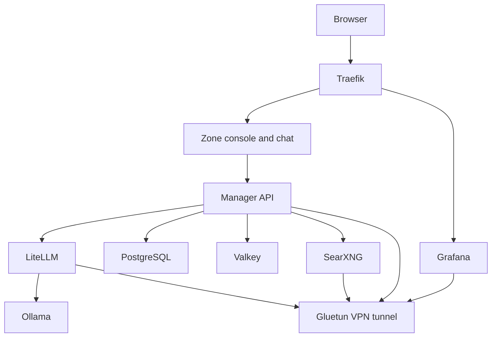

# Zone - Self-Hosted AI Platform

Your AI, your data, your infrastructure—put your backlog on autopilot.

## Features

### AI & LLM
- **Local LLM Inference**: Run powerful language models locally with Ollama
- **Intelligent Routing**: Automatic model selection based on query complexity (LiteLLM)
- **Zone Chat**: Built-in conversations, history, web search, and agent tools
- **Private Web Search** (optional): VPN-protected metasearch engine; when the VPN is on, all stack internet traffic uses the same tunnel

### Platform Management
- **Multi-Tenant Architecture**: Organizations and workspaces for team collaboration
- **Role-Based Access Control**: Fine-grained permissions with users, roles, and policies
- **Project & Task Management**: Organize work with agentic task execution
- **MCP tools**: Attach stdio MCP servers (magents by default) so tasks can spawn or message other coding agents
- **Source Integration**: Connect and manage various data sources
- **Wiki & Documentation**: Built-in knowledge base per workspace
- **Theme Customization**: Workspace-specific theming

### Infrastructure
- **Reverse Proxy**: Automatic HTTPS with Let's Encrypt (Traefik)
- **Comprehensive Monitoring**: Prometheus metrics with Grafana dashboards
- **Security First**: JWT authentication, basic auth, secrets management, no telemetry

## Architecture



## Quick Start

**Zero configuration required!** Install Ollama, copy `.env.example` to `.env`, create basic auth, and start:

```bash
# Host Ollama is the default engine (Apple GPU / Docker Desktop)
ollama serve
cp .env.example .env
mkdir -p auth && htpasswd -cB auth/users.htpasswd admin
make up
```

Access the services:
- **Console**: `https://manager.localhost` (workspace management)
- **Chat**: `https://manager.localhost/chats` (conversations and agent tools)
- **API**: `https://manager.localhost/api/`

### Prerequisites

- **Ollama** installed and listening on port 11434 (host daemon is the default engine)
- **Docker** (20.10+) and **Docker Compose** (v2.0+)
- **8GB+ RAM** (16GB+ recommended for larger models)
- **50GB+ free disk space** (models can be large)
- **NVIDIA GPU** (optional, only for `--profile bundled-ollama`)
- **VPN subscription** (optional; when enabled, all stack internet traffic uses the tunnel)

### Installation

Choose your preferred installation method:

#### Option 1: Quick Start

```bash
git clone <repository-url>
cd zone
ollama serve
cp .env.example .env
mkdir -p auth && htpasswd -cB auth/users.htpasswd admin
make up
```

Uses insecure defaults (fine for development). Host Ollama is the engine.

#### Option 2: CLI Setup Script

```bash
./scripts/setup.sh
```

Interactive command-line wizard for terminal users.

### Local Ollama (default)

Zone talks to the Ollama daemon on the host so Docker Desktop can use the Apple GPU. Keep it running on port 11434, then pull models with `make pull-models`.

To run Ollama inside Docker instead (Linux with NVIDIA GPU passthrough):

```bash
# in .env
OLLAMA_BASE_URL=http://ollama:11434
docker compose --profile bundled-ollama up -d
```

### Post-Installation

1. **Pull models into host Ollama** (if they are not already local)

   ```bash
   make pull-models
   make list-models
   ```

   Wait for models to download (10-30 minutes depending on your connection).

2. **Access the services**

   - Console: `https://manager.localhost` - Manage workspaces, projects, tasks
   - Chat: `https://manager.localhost/chats` - Chat with AI models

## Services

### Core Services

| Service | Description | Port | Tech Stack |
|---------|-------------|------|------------|
| **Manager API** | Backend API for platform management | 8000 | Rust, Axum, sqlx |
| **Manager Console** | Web frontend for workspace management and chat | 5173 | React 19, TypeScript, Tailwind |
| **LiteLLM** | LLM proxy with semantic routing | 4000 | Python |
| **Ollama** | Local LLM inference engine | 11434 | Go |
| **PostgreSQL** | Database with pgvector | 5432 | PostgreSQL 16 |
| **Valkey** | In-memory cache | 6379 | Valkey (Redis fork) |
| **Traefik** | Reverse proxy with TLS | 80, 443 | Go |

### Optional Services (Profiles)

| Profile | Services | Description |
|---------|----------|-------------|
| `vpn` | Gluetun, SearXNG | Full-tunnel VPN for stack internet traffic |
| `monitoring` | Prometheus, Grafana | Metrics and dashboards |

## Configuration

### Model Selection

Configure models in `.env` based on your hardware:

| Hardware | Fast Model | Reasoning Model | Embedding Model |
|----------|-----------|----------------|-----------------|
| 8GB RAM | `llama3.2:3b` | `deepseek-r1:7b` | `nomic-embed-text` |
| 16GB RAM | `llama3.1:8b` | `deepseek-r1:14b` | `nomic-embed-text` |
| 32GB RAM | `llama3.1:70b` | `deepseek-r1:32b` | `mxbai-embed-large` |

Browse more models at [Ollama Library](https://ollama.com/library).

### VPN Configuration (Optional)

VPN is optional. Zone chat works without it; private web search requires the VPN profile. When the VPN is on, internet-facing services share Gluetun's network so all of their traffic uses the tunnel (search, model catalogs, LiteLLM providers, Grafana alerts, bundled engine pulls, and tool HTTP). Host Ollama or ComfyUI daemons still use the host network.

To enable the VPN:
```bash
# Add VPN credentials to .env
# Saves ZONE_VPN=1, attaches services to Gluetun, and starts the VPN profile
make up-vpn
```

Supported providers: Surfshark, NordVPN, ExpressVPN, ProtonVPN, Mullvad, and more. See [Gluetun Wiki](https://github.com/qdm12/gluetun-wiki).

### Existing installations

Zone chat replaces the former Open WebUI service. After updating Compose, remove
only its retired container with `docker stop openwebui && docker rm openwebui`.
The existing `zone_openwebui_data` volume remains on disk; do not delete or prune
it if you need the old history. Zone chat stores its own history in PostgreSQL.
The shared `DOMAIN_HOST_WEBUI` base-domain setting remains compatible.

### Monitoring

Enable comprehensive monitoring with Grafana dashboards:

```bash
docker compose --profile monitoring up -d
```

Pre-built dashboards for:
- Manager Console & API
- Ollama (LLM inference metrics)
- LiteLLM (routing metrics)
- PostgreSQL (database performance)
- Traefik (proxy metrics)
- Valkey (cache metrics)
- SearXNG & Gluetun (search/VPN)

Access Grafana at `https://grafana.localhost`.

## Usage

### Makefile Commands

```bash
make help              # Show all available commands

# Setup
make setup             # Run interactive setup
make setup-auth        # Generate basic auth
make validate          # Validate configuration

# Operations
make up                # Start all services
make down              # Stop all services
make restart           # Restart all services
make logs              # Show recent logs
make logs-follow       # Follow logs
make ps                # Show service status

# With Profiles
make up-vpn            # Start with full-tunnel VPN
make up-monitoring     # Start with monitoring

# Health & Monitoring
make health            # Check service health
make stats             # Show resource usage

# Model Management
make pull-models       # Manually pull models
make list-models       # List downloaded models

# Development
make dev               # Start with live logs
make rebuild           # Rebuild and restart
make test              # Run tests
make lint              # Run linters

# Maintenance
make backup            # Backup volumes
make restore BACKUP=x  # Restore from backup
make clean             # Remove containers
make update            # Update images
```

### API Usage

#### LiteLLM OpenAI-Compatible API

```bash
curl https://api.yourdomain.com/v1/chat/completions \
  -H "Content-Type: application/json" \
  -H "Authorization: Bearer ${LITELLM_MASTER_KEY}" \
  -d '{
    "model": "fast",
    "messages": [{"role": "user", "content": "Hello!"}]
  }'
```

#### Manager API

```bash
# Authenticate
curl -X POST https://manager.yourdomain.com/api/auth/login \
  -H "Content-Type: application/json" \
  -d '{"email": "user@example.com", "password": "password"}'

# List workspaces (with JWT token)
curl https://manager.yourdomain.com/api/workspaces \
  -H "Authorization: Bearer ${JWT_TOKEN}"
```

### Zone app & CLI

The Zone desktop app ships the manager console. On first launch it asks for your Zone server URL. The `zone` CLI is linked on your PATH.

**Homebrew** (macOS):

```bash
brew tap abnegate/tap
brew install --cask zone
```

**APT** (Debian / Ubuntu):

```bash
curl -fsSL https://abnegate.github.io/apt-repo/pubkey.gpg | sudo gpg --dearmor -o /usr/share/keyrings/abnegate.gpg
echo "deb [signed-by=/usr/share/keyrings/abnegate.gpg] https://abnegate.github.io/apt-repo stable main" | sudo tee /etc/apt/sources.list.d/abnegate.list
sudo apt update && sudo apt install zone
```

Then open **Zone.app** (macOS) or run `zone-desktop` (Linux). First launch is a short configurator; after that the app serves the bundled manager frontend and proxies API traffic to the saved server (`host` in `~/.zone/config.toml` on desktop, or the app config directory on Android/iOS). Use **Change Server…** in the app menu on desktop, or **Change Server** in the sidebar on mobile, to point at a different host.

**From source:**

```bash
make install-cli
```

Desktop app (builds the manager frontend first):

```bash
make desktop
```

Android and iOS use the same Tauri client. Prerequisites: Android Studio / Android SDK, Xcode, and CocoaPods. Then:

```bash
make setup-mobile
make android-init   # once
make ios-init       # once
make android        # emulator or device
make ios            # simulator or device
```

The first launch on every platform asks for your Zone server URL. Config is stored in `~/.zone/config.toml` on desktop and in the app config directory on mobile.

```bash
# Login to your Zone server
zone login https://zone.example.com

# Run an agent task
zone run "Add input validation to the user form"

# Resume a previous session
zone resume

# List recent sessions
zone sessions

# Logout
zone logout
```

### Model Selection

The system provides three models:

- **auto** (default): Routes to fast or reason based on query complexity
- **fast** (llama3.1:8b): Quick responses for simple queries
- **reason** (deepseek-r1:14b): Thorough reasoning for complex analysis

## Development

### Tech Stack

| Component | Technology |
|-----------|------------|
| Backend | Rust 1.83+, Axum, sqlx, Redis |
| Frontend | React 19, TypeScript, Tailwind CSS, React Router |
| Database | PostgreSQL 16 with pgvector |
| Cache | Valkey (Redis fork) |
| Testing | Cargo test (backend), Jest + Playwright (frontend) |
| CI/CD | GitHub Actions |

### Local Development

```bash
# Start in development mode
make dev

# Run backend tests
cd runner && cargo test

# Run frontend tests
cd manager/frontend && bun test

# Run E2E tests
cd manager/frontend && bun run test:e2e

# Install the zone CLI
make install-cli
```

### Database Migrations

Migrations are in `runner/zone_server/migrations/`:

1. `001_initial_schema.sql` - Core tables (chats, messages, projects, tasks)
2. `002_wiki_schema.sql` - Wiki/documentation
3. `003_agentic_tasks.sql` - Task execution framework
4. `004_sources.sql` - Source integration
5. `005_source_categories.sql` - Source taxonomy
6. `006_auth_rbac.sql` - Users, roles, permissions
7. `007_organizations_workspaces.sql` - Multi-tenancy
8. `008_workspace_themes.sql` - Theme customization

### Project Structure

```
zone/
├── runner/                  # Rust backend workspace
│   ├── zone_core/           # Shared agent logic & types
│   │   ├── src/agent/       # Agent loop implementation
│   │   ├── src/llm/         # LLM client
│   │   ├── src/tools/       # Agent tools
│   │   ├── src/session/     # Session management
│   │   └── src/types/       # Shared domain types
│   ├── zone_server/         # HTTP/WS server
│   │   ├── src/routes/      # API endpoints
│   │   ├── src/db/          # Database queries (sqlx)
│   │   ├── src/cache/       # Redis cache layer
│   │   └── src/auth/        # JWT & password auth
│   ├── zone_cli/            # CLI tool
│   ├── zone_runner/         # Daemon binary
│   └── tool_runner/         # Command execution
├── manager/                 # Manager frontend
│   └── frontend/            # React frontend
│       ├── src/components/  # UI components
│       ├── src/pages/       # Page components
│       └── src/context/     # React context
├── litellm/                 # LLM proxy configuration
├── ollama/                  # Model pulling scripts
├── searxng/                 # Search engine config
├── traefik/                 # Reverse proxy config
├── prometheus/              # Metrics collection
├── grafana/                 # Dashboards
├── docker-compose.yml       # Multi-profile deployment
├── Makefile                 # Operational commands
└── .env.example             # Configuration template
```

## Security

### Best Practices

1. **Never commit `.env` file** - Contains secrets
2. **Use strong passwords** - For basic auth and user accounts
3. **Rotate secrets regularly** - JWT secrets, API keys
4. **Keep images updated** - Run `make update` monthly
5. **Review logs** - Monitor for suspicious activity
6. **Use VPN when you want a full tunnel** - All stack internet traffic through Gluetun
7. **Enable fail2ban** - On the host system (optional)

### Authentication

- **Basic Auth**: Traefik-level authentication for all services
- **JWT Tokens**: API authentication with refresh tokens
- **RBAC**: Role-based access control for fine-grained permissions

## System Requirements

### Minimum

- 4 CPU cores
- 8GB RAM
- 50GB disk space
- Docker 20.10+

### Recommended

- 8+ CPU cores
- 16GB+ RAM
- 100GB+ SSD
- NVIDIA GPU (6GB+ VRAM)
- Docker 24.0+

### Tested Platforms

- Ubuntu 22.04 LTS / 24.04 LTS
- Debian 11 / 12
- macOS (Docker Desktop)
- Windows 11 (Docker Desktop + WSL2)

## Troubleshooting

### Models not pulling

```bash
docker compose logs ollama-init
docker exec ollama ollama pull llama3.1:8b
```

### VPN not connecting

```bash
docker compose logs gluetun
# Check credentials in .env
```

### Database connection issues

```bash
docker compose logs postgres
docker exec -it postgres pg_isready
```

### Out of memory

```bash
# Use smaller models in .env
OLLAMA_MODEL_FAST=llama3.2:3b
OLLAMA_MODEL_REASON=deepseek-r1:7b
```

### Service won't start

```bash
make health
docker compose logs <service-name>
docker compose restart <service-name>
```

## Backup & Recovery

```bash
# Backup all volumes
make backup

# Restore from backup
make restore BACKUP=backups/zone_backup_20250101_120000.tar.gz
```

## License

MIT License - See [LICENSE](LICENSE) file for details.

## Contributing

See [CONTRIBUTING.md](CONTRIBUTING.md) for development guidelines. Pull requests
receive free [CodeRabbit](https://coderabbit.ai) AI reviews.

## Acknowledgments

- [Ollama](https://ollama.com/) - Local LLM inference
- [LiteLLM](https://github.com/BerriAI/litellm) - LLM proxy and routing
- [SearXNG](https://github.com/searxng/searxng) - Metasearch engine
- [Gluetun](https://github.com/qdm12/gluetun) - VPN client
- [Traefik](https://traefik.io/) - Reverse proxy
- [Axum](https://github.com/tokio-rs/axum) - Rust web framework
- [sqlx](https://github.com/launchbadge/sqlx) - Async Rust SQL toolkit

---

**Built with privacy and performance in mind.**


## Workspace assistant tools

Agent mode always provides workspace tools and server filesystem and shell tools. Commands and file operations run with the server process permissions, inside the container and mounted paths for Docker deployments; they do not grant access to the Docker host. Workspace writes require the authenticated member's current permissions and a user request.

- Tasks and people: `list_tasks`, `create_task`, `update_task`, `list_members`. Tasks support assignment and completion; operational task-run transitions remain separate.
- Documents: `list_documents` (optional full-text `query`), `read_document`, `create_document`, `update_document`. Local notes are immediately searchable without an embedding service and appear in the knowledge base. Imported documents include snapshot freshness; only local notes can be edited.
- Chat actions: `list_chats`, `send_message`, including workspace member mentions. Messages persist in the destination chat and appear live on connected clients on the delivering server. Mentions label recipients in the chat; they do not send external notifications.
- Reminders: `create_reminder`, `list_reminders`, `cancel_reminder`. Supply a future RFC 3339 timestamp with timezone. The server checks due reminders every ten seconds and persists an assistant message in the selected workspace chat, including after a restart. Delivery is cancelled if the creator loses write access or the chat becomes unavailable. There is no email or push delivery.
- Live GitHub: `get_build_status`, `list_deployments`, `list_issues`, `read_repository_file`. Configure an active GitHub source in the workspace with `owner` and `repo`, optional `branch` and `path`, and an access token for private repositories. Stored encrypted source credentials take precedence over a configured token. Requests use GitHub's API and resolve file/build/deployment references to immutable commit IDs. Missing or incomplete check evidence never counts as green; deployment records do not establish service health. Other CI providers and ticket systems are not supported by these tools.
- Existing inventory and search: `list_sources`, `list_projects`, `search_knowledge` when a context service is configured, and `search_chat_history` when an embedding service is configured.

Database migrations run automatically at server startup, including workspace action storage and document search indexes. Keep the server running for scheduled delivery. Set `ZONE_CHAT_AGENT_CWD` to choose the working directory for server tools. Disable Agent mode for chats that should not use tools.
