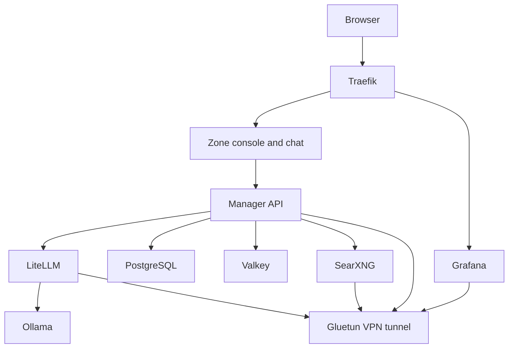

# Zone - Self-Hosted AI Platform

Your AI, your data, your infrastructure—put your backlog on autopilot.

## Features

### AI & LLM
- **Local LLM Inference**: Run powerful language models locally with Ollama
- **Intelligent Routing**: Automatic model selection based on query complexity (LiteLLM)
- **Zone Chat**: Built-in conversations, history, web search, and agent tools
- **Private Web Search** (optional): VPN-protected metasearch engine; when the VPN is on, all stack internet traffic uses the same tunnel

### Platform Management
- **Multi-Tenant Architecture**: Organizations and workspaces for team collaboration
- **Role-Based Access Control**: Fine-grained permissions with users, roles, and policies
- **Project & Task Management**: Organize work with agentic task execution
- **MCP tools**: Attach stdio MCP servers (magents by default) so tasks can spawn or message other coding agents
- **Source Integration**: Connect and manage various data sources
- **Wiki & Documentation**: Built-in knowledge base per workspace
- **Theme Customization**: Workspace-specific theming

### Infrastructure
- **Reverse Proxy**: Automatic HTTPS with Let's Encrypt (Traefik)
- **Comprehensive Monitoring**: Prometheus metrics with Grafana dashboards
- **Security First**: JWT authentication, basic auth, secrets management, no telemetry

## Architecture



## Quick Start

**Zero configuration required!** Install Ollama, copy `.env.example` to `.env`, create basic auth, and start:

```bash
# Host Ollama is the default engine (Apple GPU / Docker Desktop)
ollama serve
cp .env.example .env
mkdir -p auth && htpasswd -cB auth/users.htpasswd admin
make up
```

Access the services:
- **Console**: `https://manager.localhost` (workspace management)
- **Chat**: `https://manager.localhost/chats` (conversations and agent tools)
- **API**: `https://manager.localhost/api/`

### Prerequisites

- **Ollama** installed and listening on port 11434 (host daemon is the default engine)
- **Docker** (20.10+) and **Docker Compose** (v2.0+)
- **8GB+ RAM** (16GB+ recommended for larger models)
- **50GB+ free disk space** (models can be large)
- **NVIDIA GPU** (optional, only for `--profile bundled-ollama`)
- **VPN subscription** (optional; when enabled, all stack internet traffic uses the tunnel)

### Installation

Choose your preferred installation method:

#### Option 1: Quick Start

```bash
git clone <repository-url>
cd zone
ollama serve
cp .env.example .env
mkdir -p auth && htpasswd -cB auth/users.htpasswd admin
make up
```

Uses insecure defaults (fine for development). Host Ollama is the engine.

#### Option 2: CLI Setup Script

```bash
./scripts/setup.sh
```

Interactive command-line wizard for terminal users.

### Local Ollama (default)

Zone talks to the Ollama daemon on the host so Docker Desktop can use the Apple GPU. Keep it running on port 11434, then pull models with `make pull-models`.

To run Ollama inside Docker instead (Linux with NVIDIA GPU passthrough):

```bash
# in .env
OLLAMA_BASE_URL=http://ollama:11434
./scripts/compose.sh --profile bundled-ollama up -d
```

### Post-Installation

1. **Pull models into host Ollama** (if they are not already local)

   ```bash
   make pull-models
   make list-models
   ```

   Wait for models to download (10-30 minutes depending on your connection).

2. **Access the services**

   - Console: `https://manager.localhost` - Manage workspaces, projects, tasks
   - Chat: `https://manager.localhost/chats` - Chat with AI models

## Services

### Core Services

| Service | Description | Port | Tech Stack |
|---------|-------------|------|------------|
| **Manager API** | Backend API for platform management | 8000 | Rust, Axum, sqlx |
| **Manager Console** | Web frontend for workspace management and chat | 5173 | React 19, TypeScript, Tailwind |
| **LiteLLM** | LLM proxy with semantic routing | 4000 | Python |
| **Ollama** | Local LLM inference engine | 11434 | Go |
| **PostgreSQL** | Database with pgvector | 5432 | PostgreSQL 16 |
| **Valkey** | In-memory cache | 6379 | Valkey (Redis fork) |
| **Traefik** | Reverse proxy with TLS | 80, 443 | Go |

### Optional Services (Profiles)

| Profile | Services | Description |
|---------|----------|-------------|
| `dev` | Manager + console overlays | Hot reload (`docker-compose.dev.yml`) |
| `vpn` | Gluetun, SearXNG | Full-tunnel VPN for stack internet traffic |
| `monitoring` | Prometheus, Grafana | Metrics and dashboards |
| `bundled-ollama` | Ollama | In-compose engine (Linux NVIDIA / CPU) |
| `bundled-comfyui` | ComfyUI | Bundled NVIDIA image/video/audio/upscale runtime |

Combine any of them in one command. Overlay files for `dev` and `vpn` are selected automatically:

```bash
make up PROFILES=dev,vpn,monitoring
# or
./scripts/compose.sh --profile dev --profile vpn --profile monitoring up -d
```

## Configuration

### Model Selection

Configure models in `.env` based on your hardware:

| Hardware | Fast Model | Reasoning Model | Embedding Model |
|----------|-----------|----------------|-----------------|
| 8GB RAM | `llama3.2:3b` | `deepseek-r1:7b` | `nomic-embed-text` |
| 16GB RAM | `llama3.1:8b` | `deepseek-r1:14b` | `nomic-embed-text` |
| 32GB RAM | `llama3.1:70b` | `deepseek-r1:32b` | `mxbai-embed-large` |

Browse more models at [Ollama Library](https://ollama.com/library).

### VPN Configuration (Optional)

VPN is optional. Zone chat works without it; private web search requires the VPN profile. When the VPN is on, internet-facing services share Gluetun's network so all of their traffic uses the tunnel (search, model catalogs, LiteLLM providers, Grafana alerts, bundled engine pulls, and tool HTTP). Host Ollama or ComfyUI daemons still use the host network.

To enable the VPN:
```bash
# Add VPN credentials to .env
# Saves ZONE_VPN=1, attaches services to Gluetun, and starts the VPN profile
make up-vpn
# or combine with other profiles:
make up PROFILES=dev,vpn,monitoring
```

Supported providers: Surfshark, NordVPN, ExpressVPN, ProtonVPN, Mullvad, and more. See [Gluetun Wiki](https://github.com/qdm12/gluetun-wiki).

### Existing installations

Zone chat replaces the former Open WebUI service. After updating Compose, remove
only its retired container with `docker stop openwebui && docker rm openwebui`.
The existing `zone_openwebui_data` volume remains on disk; do not delete or prune
it if you need the old history. Zone chat stores its own history in PostgreSQL.
The shared `DOMAIN_HOST_WEBUI` base-domain setting remains compatible.

### Monitoring

Enable comprehensive monitoring with Grafana dashboards:

```bash
make up PROFILES=monitoring
# or
./scripts/compose.sh --profile monitoring up -d
```

Pre-built dashboards for:
- Manager Console & API
- Ollama (LLM inference metrics)
- LiteLLM (routing metrics)
- PostgreSQL (database performance)
- Traefik (proxy metrics)
- Valkey (cache metrics)
- SearXNG & Gluetun (search/VPN)

Access Grafana at `https://grafana.localhost`.

## Usage

### Makefile Commands

```bash
make help              # Show all available commands

# Setup
make setup             # Run interactive setup
make setup-auth        # Generate basic auth
make validate          # Validate configuration

# Operations
make up                # Start core services
make down              # Stop all services
make restart           # Restart all services
make logs              # Show recent logs
make logs-follow       # Follow logs
make ps                # Show service status

# With Profiles (combine any: dev,vpn,monitoring)
make up PROFILES=dev,vpn,monitoring
make up-vpn            # Start with full-tunnel VPN
make up-monitoring     # Start with Prometheus + Grafana
make up-all            # VPN + monitoring

# Health & Monitoring
make health            # Check service health
make stats             # Show resource usage

# Model Management
make pull-models       # Manually pull models
make list-models       # List downloaded models

# Development
make dev               # Start with live logs
make rebuild           # Rebuild and restart
make test              # Run tests
make lint              # Run linters

# Maintenance
make backup            # Backup volumes
make restore BACKUP=x  # Restore from backup
make clean             # Remove containers
make update            # Update images
```

### API Usage

#### LiteLLM OpenAI-Compatible API

```bash
curl https://api.yourdomain.com/v1/chat/completions \
  -H "Content-Type: application/json" \
  -H "Authorization: Bearer ${LITELLM_MASTER_KEY}" \
  -d '{
    "model": "fast",
    "messages": [{"role": "user", "content": "Hello!"}]
  }'
```

#### Manager API

```bash
# Authenticate
curl -X POST https://manager.yourdomain.com/api/auth/login \
  -H "Content-Type: application/json" \
  -d '{"email": "user@example.com", "password": "password"}'

# List workspaces (with JWT token)
curl https://manager.yourdomain.com/api/workspaces \
  -H "Authorization: Bearer ${JWT_TOKEN}"
```

### Zone app & CLI

The Zone desktop app ships the manager console. On first launch it asks for your Zone server URL. The `zone` CLI is linked on your PATH.

**Homebrew** (macOS):

```bash
brew tap abnegate/tap
brew install --cask zone
```

**APT** (Debian / Ubuntu):

```bash
curl -fsSL https://abnegate.github.io/apt-repo/pubkey.gpg | sudo gpg --dearmor -o /usr/share/keyrings/abnegate.gpg
echo "deb [signed-by=/usr/share/keyrings/abnegate.gpg] https://abnegate.github.io/apt-repo stable main" | sudo tee /etc/apt/sources.list.d/abnegate.list
sudo apt update && sudo apt install zone
```

Then open **Zone.app** (macOS) or run `zone-desktop` (Linux). First launch is a short configurator; after that the app serves the bundled manager frontend and proxies API traffic to the saved server (`host` in `~/.zone/config.toml` on desktop, or the app config directory on Android/iOS). Use **Change Server…** in the app menu on desktop, or **Change Server** in the sidebar on mobile, to point at a different host.

**From source:**

```bash
make install-cli
```

Desktop app (builds the manager frontend first):

```bash
make desktop
```

Android and iOS use the same Tauri client. Prerequisites: Android Studio / Android SDK, Xcode, and CocoaPods. Then:

```bash
make setup-mobile
make android-init   # once
make ios-init       # once
make android        # emulator or device
make ios            # simulator or device
```

The first launch on every platform asks for your Zone server URL. Config is stored in `~/.zone/config.toml` on desktop and in the app config directory on mobile.

```bash
# Login to your Zone server
zone login https://zone.example.com

# Run an agent task
zone run "Add input validation to the user form"

# Resume a previous session
zone resume

# List recent sessions
zone sessions

# Logout
zone logout
```

### Model Selection

The system provides three models:

- **auto** (default): Routes to fast or reason based on query complexity
- **fast** (llama3.1:8b): Quick responses for simple queries
- **reason** (deepseek-r1:14b): Thorough reasoning for complex analysis

## Development

### Tech Stack

| Component | Technology |
|-----------|------------|
| Backend | Rust 1.83+, Axum, sqlx, Redis |
| Frontend | React 19, TypeScript, Tailwind CSS, React Router |
| Database | PostgreSQL 16 with pgvector |
| Cache | Valkey (Redis fork) |
| Testing | Cargo test (backend), Jest + Playwright (frontend) |
| CI/CD | GitHub Actions |

### Local Development

```bash
# Start in development mode
make dev

# Run backend tests
cd runner && cargo test

# Run frontend tests
cd manager/frontend && bun test

# Run E2E tests
cd manager/frontend && bun run test:e2e

# Install the zone CLI
make install-cli
```

### Database Migrations

Migrations are in `runner/zone_server/migrations/`:

1. `001_initial_schema.sql` - Core tables (chats, messages, projects, tasks)
2. `002_wiki_schema.sql` - Wiki/documentation
3. `003_agentic_tasks.sql` - Task execution framework
4. `004_sources.sql` - Source integration
5. `005_source_categories.sql` - Source taxonomy
6. `006_auth_rbac.sql` - Users, roles, permissions
7. `007_organizations_workspaces.sql` - Multi-tenancy
8. `008_workspace_themes.sql` - Theme customization

### Project Structure

```
zone/
├── runner/                  # Rust backend workspace
│   ├── zone_core/           # Shared agent logic & types
│   │   ├── src/agent/       # Agent loop implementation
│   │   ├── src/llm/         # LLM client
│   │   ├── src/tools/       # Agent tools
│   │   ├── src/session/     # Session management
│   │   └── src/types/       # Shared domain types
│   ├── zone_comfy/          # ComfyUI generation, model inventory, LoRA training
│   │   ├── src/client.rs    # Image, video, and audio generation, and upscaling
│   │   ├── src/recipe.rs    # Workflow recipes and catalog
│   │   ├── src/inventory.rs # Installed weights on disk
│   │   ├── src/lora.rs      # LoRA training jobs
│   │   ├── src/video.rs     # Training frames pulled out of a submitted clip
│   │   ├── src/subject.rs   # Subject-aware framing for training crops
│   │   └── src/caption.rs   # Vision captioning for training sets
│   ├── zone_email/          # Transactional email over SMTP
│   ├── zone_search/         # SearXNG web search client
│   ├── zone_vcs/            # Local git operations and GitHub pull requests
│   ├── zone_vision/         # Subject detection and subject-aware cropping
│   ├── zone_server/         # HTTP/WS server
│   │   ├── src/routes/      # API endpoints
│   │   ├── src/db/          # Database queries (sqlx)
│   │   ├── src/cache/       # Redis cache layer
│   │   └── src/auth/        # JWT & password auth
│   ├── zone_cli/            # CLI tool
│   ├── zone_runner/         # Daemon binary
│   └── tool_runner/         # Command execution
├── manager/                 # Manager frontend
│   └── frontend/            # React frontend
│       ├── src/components/  # UI components
│       ├── src/pages/       # Page components
│       └── src/context/     # React context
├── litellm/                 # LLM proxy configuration
├── ollama/                  # Model pulling scripts
├── searxng/                 # Search engine config
├── traefik/                 # Reverse proxy config
├── prometheus/              # Metrics collection
├── grafana/                 # Dashboards
├── docker-compose.yml       # Multi-profile deployment
├── Makefile                 # Operational commands
└── .env.example             # Configuration template
```

## Security

### Best Practices

1. **Never commit `.env` file** - Contains secrets
2. **Use strong passwords** - For basic auth and user accounts
3. **Rotate secrets regularly** - JWT secrets, API keys
4. **Keep images updated** - Run `make update` monthly
5. **Review logs** - Monitor for suspicious activity
6. **Use VPN when you want a full tunnel** - All stack internet traffic through Gluetun
7. **Enable fail2ban** - On the host system (optional)

### Authentication

- **Basic Auth**: Traefik-level authentication for all services
- **JWT Tokens**: API authentication with refresh tokens
- **RBAC**: Role-based access control for fine-grained permissions

## System Requirements

### Minimum

- 4 CPU cores
- 8GB RAM
- 50GB disk space
- Docker 20.10+

### Recommended

- 8+ CPU cores
- 16GB+ RAM
- 100GB+ SSD
- NVIDIA GPU (6GB+ VRAM)
- Docker 24.0+

### Tested Platforms

- Ubuntu 22.04 LTS / 24.04 LTS
- Debian 11 / 12
- macOS (Docker Desktop)
- Windows 11 (Docker Desktop + WSL2)

## Troubleshooting

### Models not pulling

```bash
docker compose logs ollama-init
docker exec ollama ollama pull llama3.1:8b
```

### VPN not connecting

```bash
docker compose logs gluetun
# Check credentials in .env
```

### Database connection issues

```bash
docker compose logs postgres
docker exec -it postgres pg_isready
```

### Out of memory

```bash
# Use smaller models in .env
OLLAMA_MODEL_FAST=llama3.2:3b
OLLAMA_MODEL_REASON=deepseek-r1:7b
```

### Service won't start

```bash
make health
docker compose logs <service-name>
docker compose restart <service-name>
```

## Backup & Recovery

```bash
# Backup all volumes
make backup

# Restore from backup
make restore BACKUP=backups/zone_backup_20250101_120000.tar.gz
```

## License

MIT License - See [LICENSE](LICENSE) file for details.

## Contributing

See [CONTRIBUTING.md](CONTRIBUTING.md) for development guidelines. Pull requests
receive free [CodeRabbit](https://coderabbit.ai) AI reviews.

## Acknowledgments

- [Ollama](https://ollama.com/) - Local LLM inference
- [LiteLLM](https://github.com/BerriAI/litellm) - LLM proxy and routing
- [SearXNG](https://github.com/searxng/searxng) - Metasearch engine
- [Gluetun](https://github.com/qdm12/gluetun) - VPN client
- [Traefik](https://traefik.io/) - Reverse proxy
- [Axum](https://github.com/tokio-rs/axum) - Rust web framework
- [sqlx](https://github.com/launchbadge/sqlx) - Async Rust SQL toolkit

---

**Built with privacy and performance in mind.**


## Workspace assistant tools

Agent mode always provides workspace tools and server filesystem and shell tools. Commands and file operations run with the server process permissions, inside the container and mounted paths for Docker deployments; they do not grant access to the Docker host. Workspace writes require the authenticated member's current permissions and a user request.

- Tasks and people: `list_tasks`, `create_task`, `update_task`, `list_members`. Tasks support assignment and completion; operational task-run transitions remain separate.
- Documents: `list_documents` (optional full-text `query`), `read_document`, `create_document`, `update_document`. Local notes are immediately searchable without an embedding service and appear in the knowledge base. Imported documents include snapshot freshness; only local notes can be edited.
- Chat actions: `list_chats`, `send_message`, including workspace member mentions. Messages persist in the destination chat and appear live on connected clients on the delivering server. Mentions label recipients in the chat; they do not send external notifications.
- Reminders: `create_reminder`, `list_reminders`, `cancel_reminder`. Supply a future RFC 3339 timestamp with timezone. The server checks due reminders every ten seconds and persists an assistant message in the selected workspace chat, including after a restart. Delivery is cancelled if the creator loses write access or the chat becomes unavailable. There is no email or push delivery.
- Live GitHub: `get_build_status`, `list_deployments`, `list_issues`, `read_repository_file`. Configure an active GitHub source in the workspace with `owner` and `repo`, optional `branch` and `path`, and an access token for private repositories. Stored encrypted source credentials take precedence over a configured token. Requests use GitHub's API and resolve file/build/deployment references to immutable commit IDs. Missing or incomplete check evidence never counts as green; deployment records do not establish service health. Other CI providers and ticket systems are not supported by these tools.
- Existing inventory and search: `list_sources`, `list_projects`, `search_knowledge` when a context service is configured, and `search_chat_history` when an embedding service is configured.
- Asking you: `ask_user` puts multiple-choice questions to you when the answer changes what the agent does next, rather than guessing and reporting the guess. The tool accepts up to four questions in one card; the system prompt tells the agent to aim for one and treat three as the ceiling. Each question carries two to four options with the recommendation first, plus an "Other" choice you can type into. Calling the tool ends the turn: the agent stops, and the answer you pick arrives as the next user message, so the conversation reads as what it is. In a chat the card is shown as it is asked and stored on the turn, so it is still there after a reload. A background task run parks instead — its status becomes `waiting`, and an owner, admin or member can answer it from the run view, never a viewer. When every question in the set is optional the run proceeds on the recommended option after about thirty seconds; a required question has no window and waits for a real answer. The wait sits inside the run's one-hour timeout, which is terminal: a run that times out fails and is not retried.
- Waiting instead of polling: `background: true` on `run_shell` or `run_command` detaches the command and returns at once with a job id and a log path, and `tail_job` reads that log from a byte offset, under the same `max_output_chars` as the shell tools, ending with the job's state: `running`, `exited <code>`, `killed` or `flooded`. Logs live in `.zone/jobs/` under the session's working directory, which is a task run's own checkout or, for a chat, `ZONE_CHAT_AGENT_CWD`. A task run also adds `.zone/` to its checkout's git exclude file so the logs stay out of its diff; a chat does not, because its working directory is the host checkout, whose `.git` may be a pointer into a directory every worktree of the repository shares. Isolation between sessions is advisory: `tail_job` and `wait_for` refuse a job that another chat or run started, but every session runs as the same operating-system user, and a shell command can still read any path. A job is killed after 900 seconds, the cap a foreground command already runs under, or once its log passes 64 MiB, in which case it is reported as flooded and never as finished, and it ends with the chat turn or the task run that started it, whichever comes first, taking its log with it, because nothing can read a log once the session that owned it is gone. Its exit wakes nothing by itself: the loop is re-invoked on a job's exit only through `wait_for`, which is all that shipped of the research backlog's "re-invoked when the job exits". `wait_for` takes a background job, a task run or the checks on a commit (`kind=job`, `task_run` or `check`). Calling it ends the turn with a receipt naming the subject and the deadline; the outcome arrives when the loop resumes, with the round refunded rather than spent, and a wait that runs out says "this is a timeout, not a result" rather than reading as anything having happened. A wait is 15 to 1800 seconds, 300 by default, and ten waits are the limit per chat turn and per task attempt: the eleventh is an error, not a wait. A task run parks with status `waiting` and hands its execution slot back until the wait settles, all inside the run's one-hour timeout; the run route reports what it waits for as `waiting_on`, the run view reads `Waiting for <subject>` rather than a question, and it cannot be answered. A chat wait runs inside the turn's own deadline (`ZONE_CHAT_TIMEOUT_SECONDS`, 1800 seconds): a wait longer than the turn has left is clamped to what remains and comes back as a timeout, and the turn carries on in the same assistant message afterwards. The turn is not tied to your connection, so a wait can outlive the browser: it keeps running until it settles or a reconnected client cancels it, your next message queues behind it, anything else that reaches for the chat's lease in the meantime is refused with "This chat already has an active response", and a turn stopped mid-wait with nothing said is stored as "[Stopped while waiting]". GitHub checks are polled every 30 seconds against the commit the reference resolved to, because no check webhook exists, and only success or failure settles the wait; a commit that nothing is reporting on after 120 seconds ends it with "This is not a pass", and one whose checks could not be read ends it saying so and why, which is a different thing from a repository that reports nothing. `kind=task_run` is available from a chat only, never from inside a task run. `wait_for` checks that you can read the run or the source once, when it opens, and holds its subscription without checking again, so a membership revoked mid-wait is not observed for up to 1800 seconds: the outcome is still delivered, and the tools rebuilt for the run after it are the first to notice. A wait also resets the loop's no-progress detector, which is why the prompt tells the agent that a wait is not a way to re-read something that has not changed. In a chat the tool call carries a job card and a wait card: the job's id, process id and log path and how it exited, and what is being waited for, until when, and the outcome, with a timeout, a commit nothing reported on and checks that could not be read each labelled as not a pass.
- Remembering what you asked for: `memory_list` indexes what is stored for you — each entry's name, what it is for, and the version to quote when changing it, forty entries at most — `memory_read` returns one in full, `memory_write` stores a new entry or replaces one you have read, `memory_append` adds a line to an entry without rewriting it, and `memory_delete` forgets one. There are three kinds: `profile` is who you are, `preference` is how you want the assistant to work, and `fact` is anything else, named and described so a later turn can tell whether to read it. `profile` and `preference` hold one entry each, so they take no name and ignore one supplied. The five tools are a chat surface only, and a background run is told to leave memory to whoever started it; your profile and preferences are still rendered into the guidance of a run you started, so a run acts on them but cannot write them, and it is given no fact index because it has no `memory_read` to act on one with. Memory belongs to one person inside one workspace: every statement scopes by workspace, owner and kind together, and the workspace-wide reads carry `category NOT LIKE 'memory-%'`, so no knowledge listing, document read or keyword search returns an entry, `update_document` cannot overwrite one, reading or deleting one by id through the knowledge routes answers `404` — to its owner as well, so nobody learns the id exists — and a post to the knowledge route cannot set one of these categories. Nothing here is embedded, and the pass that embeds what semantic search cannot see skips it too, so `search_knowledge` has nothing of yours to return. Deleting a user leaves their entries in place with no owner rather than removing them, and nothing reads or writes them again. `memory_write` and `memory_delete` take the version `memory_read` returned, and a version that no longer matches is reported as a conflict that hands back what the entry says now for you to merge and write again; `memory_append` takes no version and writes against the version it just read, so an append that raced another is told it conflicted and composes again from what it then reads — nothing is lost, but the order the two additions end up in is not specified. One entry holds 2 000 characters, and content over that is refused rather than shortened. The block rendered into a prompt holds 6 000 bytes: the fact index gives way first, a line at a time, and says how many entries it left out, and only then are preferences and the profile shortened, at a character boundary, each saying that it was. The server refuses to store what looks like a credential or an access token, a contact detail or an account number, or an instruction that would have the assistant hold back an error, a disagreement or a concern, and a fact's description is screened the same way its content is, because both are read every turn. The rest of the list — health, sexual orientation, religion, politics, criminal history, that someone is a minor, an inference about your state of mind — is in the system prompt and nowhere else, because a keyword list for it would refuse "remember I prefer tabs" for containing a banned word and would miss every disclosure phrased differently. A write, an append and a delete each leave an action receipt on the message the way a task or document write does, and there is no page to manage entries from: `memory_list` is the index, and the tools are the only way in. A reply written after a successful `memory_read` carries a badge reading "Memory read", set from the turn's own tool calls and never from anything the model says; it claims that stored memory was read and not that it changed the answer, and a reply shaped only by the rendered profile block carries no badge at all. The promotion worker that turns repeated answers into standing instructions now holds every candidate to the same refusal rules, over the question as well as the answer, and reports how many it withheld. Creating an entry holds a unique index over the workspace, the owner, the kind and the name of every active remembered entry, so two first writes of the same entry that overlap exactly cannot both insert: the one that loses is refused as the same conflict a stale version gets, and handed what the other wrote to merge. One limit: the promotion path enforces only the half of the rules a server can check, because a worker has no prompt to carry the rest — what keeps a one-off disclosure out of it is the occurrence and agreement bar upstream.
- Skills: a document filed under the `skill` category is a written procedure for one kind of work, and its content is a `SKILL.md` as the major assistants ship them — front matter whose `description` says when the skill applies, then the procedure. Every chat holding `read_document`, and every background run whose initiator's standing puts `read_document` in its tools, is given an index of the workspace's skills: one line each with the name, the id `read_document` opens it by, and that trigger line (read from the front matter, or from the first line of prose when a skill has none), under a rule to read the skill in full before starting work its line describes, to use one by name when asked and otherwise by what its line says it is for, never on a word alone, and to say which skill it was when one makes the assistant stop. A skill outranks the assistant's own defaults and not your request. The index lists forty skills at most, cuts a trigger at 160 characters, holds under 8 000 bytes, and says how many skills it left out past any of those; nothing else about a skill is read until it is opened. File one through the knowledge API with `category: "skill"` and the `SKILL.md` as the content:

  ```bash
  curl -X POST https://manager.yourdomain.com/api/knowledge \
    -H "Authorization: Bearer ${JWT_TOKEN}" \
    -H "Content-Type: application/json" \
    -d '{
      "workspace_id": "'"${WORKSPACE_ID}"'",
      "title": "Release checklist",
      "category": "skill",
      "content": "---\ndescription: Use when cutting, tagging or verifying a release.\n---\n1. Run the full test suite.\n2. Bump the version and tag it.\n3. Publish the release notes."
    }'
  ```
- Plan approval: a task created with `require_plan_approval` hands its runs one more tool, `submit_plan`, and tells them to plan before they change anything — what will change and in what order, how it will be checked, what is left out. The call parks the run exactly as `ask_user` does, on one required question headed "Plan approval" with the plan as its preview, so the console shows it on the run and any member can answer it; Approve buys the next turn and the run carries the plan out without asking again, Revise comes back with what to change under Other and the run submits again. Until the answer is Approve, every tool that would change something — anything above the read tier, the shell included — is refused with the reason, so the hold is enforced rather than only asked for; the tools stay listed, and it is the call that is refused. The plan is kept on the run (`plan` on the run response) once it has been asked about, so it can be read after the question is answered and gone. A task without the flag is given no `submit_plan` and no paragraph about planning, and a question about the approach is meant to go into the plan rather than into a question of its own. A plan holds 20 000 characters. Ask for it when creating the task:

  ```bash
  curl -X POST https://manager.yourdomain.com/api/workspaces/${WORKSPACE_ID}/tasks \
    -H "Authorization: Bearer ${JWT_TOKEN}" \
    -H "Content-Type: application/json" \
    -d '{
      "title": "Add a retry to the webhook sender",
      "description": "Retry a failed delivery three times with backoff before giving up.",
      "is_agentic": true,
      "require_plan_approval": true
    }'
  ```
- Worktrees: a task run with a repository works in a detached worktree of a base clone the repository's runs share, kept under `repos/` in the checkout root and named by a digest of the URL; the base is fetched before each run and cloned the first time, so a run costs a fetch and a checkout rather than a clone, and the run's branch is made on the worktree exactly as it was made on a clone. When the run ends its worktree is removed only when it holds nothing nobody else has: one that still holds changes no commit has, or a commit the service never pushed, is kept, by the guard and by crash recovery alike, and the log says where it is and why. Whether a commit is published is decided from what the service recorded about the run — the commit it started on, recorded before any tool of the run could move HEAD, and the commit the service itself pushed — never from refs in the clone, which a run's git commands could move to make its commits look published; a run whose start was never recorded is kept as a matter of course, and the status check lists untracked files explicitly and takes no excludes file from the configuration, so neither a `status.showUntrackedFiles` nor a `core.excludesFile` a run wrote into the shared configuration can hide one; a file the repository's own ignore rules cover is not work, since those rules are what the repository declares disposable. Removing a clean worktree deletes its branch with it, so the next run of the same task can make the branch again; a kept worktree holds the task's branch, and the task cannot run again until that worktree is published or removed by hand, which the run reports as the reason rather than as git's "already exists". Nothing removes a kept worktree except a person; a branch that no worktree holds any more, because a removal could not delete it or the worktree was deleted by hand, is set aside under `<branch>.abandoned.<time>` and its name taken by the next run that asks for it, so what it pointed at stays reachable. What the runs share is not trusted, since a run's own git commands reach it: before every run the base clone's git configuration is rewritten from what Zone knows, the fetch is bound to the repository's URL rather than to the remote the clone names, the run starts from the commit the repository reports for its default branch rather than from `origin/HEAD`, and readying one repository's base is serialised across runs.

Database migrations run automatically at server startup, including workspace action storage and document search indexes. Keep the server running for scheduled delivery. Set `ZONE_CHAT_AGENT_CWD` to choose the working directory for server tools. Disable Agent mode for chats that should not use tools.


Chat context is projected from the complete durable conversation before every model round. Old consumed turns are summarized at 80% of the available input window; the latest user request, current instructions, and fresh tool results stay intact. The expandable context indicator distinguishes estimates from unknown capacity and marks pending retrieval or image costs incomplete. Cancelling or losing a generation lease preserves tool evidence and records uncertain mutation outcomes without automatically repeating them.

`ZONE_CHAT_ROUNDS` (64) and `ZONE_CHAT_CALLS` (256) bound a turn, with a final tool-free response when a budget or unchanged-evidence cycle ends execution. `ZONE_CHAT_TIMEOUT_SECONDS` (1800) bounds elapsed generation time and preserves interrupted evidence on expiry. `ZONE_CHAT_OUTPUT_TOKENS` (4096) is the maximum response reservation; known small context windows reserve at most one quarter, so a 4096-token model receives `max_tokens=1024`. The same reservation applies to preview, generation, and summaries. These settings must be positive integers; invalid settings fail server startup.

`ZONE_CHAT_CONTEXT_TOKENS` (32768) is the fallback Ollama context allocation when a model has not reported a native window. Cold models use the advertised native context from Ollama `/api/show`; an already-loaded model's runtime `/api/ps` context takes precedence and is still never allowed to exceed native capacity. An explicit LiteLLM route `num_ctx` is an operator request, bounded by that native window. The env default is not a ceiling on a larger advertised window. Zone resolves the exact LiteLLM deployment through `/v2/model/info`, then uses Ollama `/api/ps` and `/api/show`; unresolved aliases remain unknown. The effective allocation is sent as LiteLLM's top-level `num_ctx`, which its Ollama adapter forwards as native `options.num_ctx`. Non-Ollama requests never receive it. Larger native windows increase Ollama memory use; the UI identifies provider, configured, and runtime capacity.
