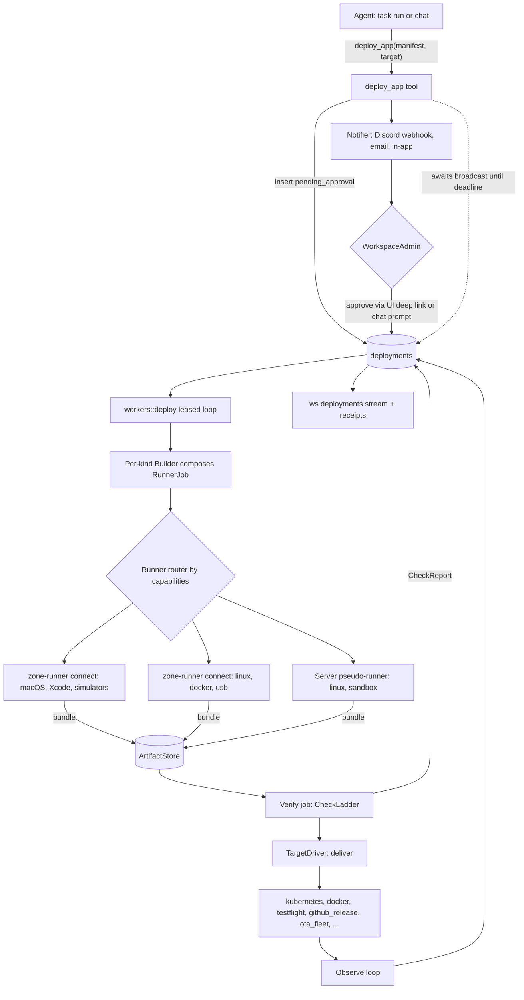
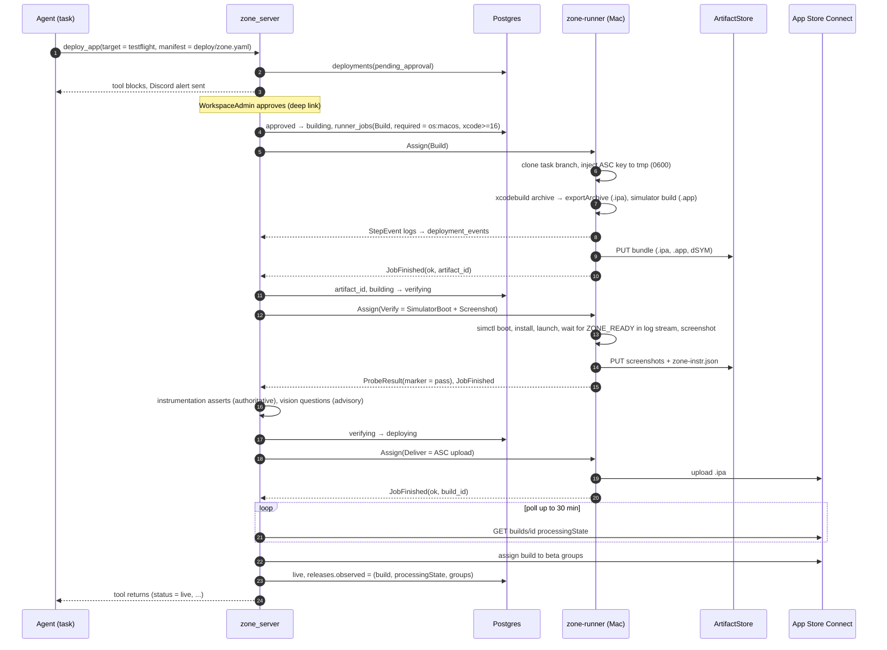
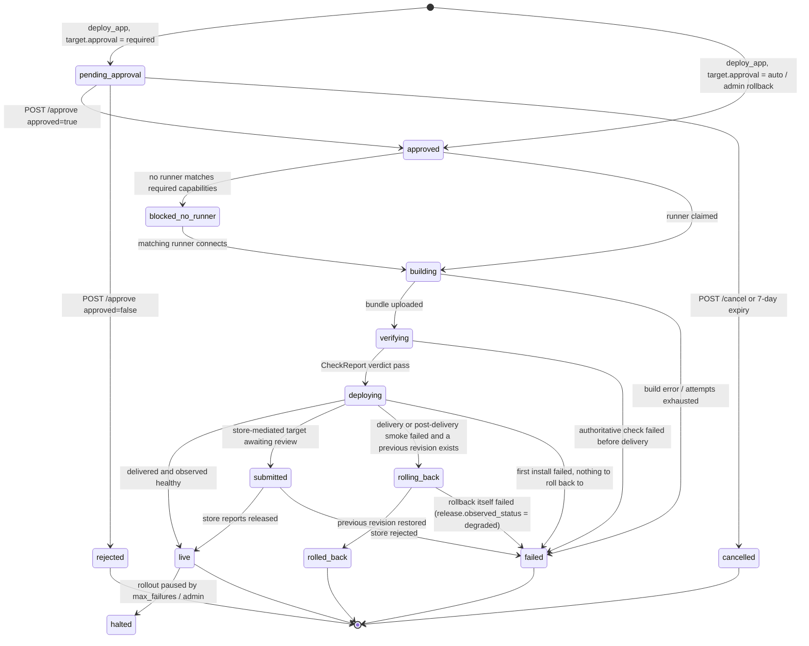

# Deployments: generate, build, deliver, verify

Zone's autonomous loop currently ends at a pull request. This document designs the rest of it:

> task → code → artifact → delivered → verified → live

for **any kind of software**: containers, static sites, serverless functions, iOS and Android apps, desktop apps, CLIs, libraries, firmware for device fleets, and game builds. The design is grounded in what zone already has (with file references to `main` at `d3fb7cf`), and borrows heavily from Appwrite's Imagine (paths prefixed `imagine:`), which solved the generation half well and left the verification half open.

## 1. Goal, non-goals, vocabulary

**Goal.** An agent (a task run or a chat) requests `deploy_app`. Zone builds the artifact on a runner that has the right toolchain, delivers it to a workspace-configured target, verifies it with checks the server executes and grades, rolls back on failure, records every step durably, streams progress, and requires a human approval by default.

**Three axes, kept independent:**

| Axis | Question it answers | Examples |
|---|---|---|
| `ArtifactKind` | What gets built, signed and verified | `container`, `ios_app`, `firmware` |
| `TargetKind` | Where it goes; what "observed state" and "rollback" mean there | `kubernetes`, `testflight`, `ota_fleet` |
| Runner capabilities | Where the build/verify/flash can physically run | `os:macos xcode:16.2`, `usb:esp32`, `docker buildkit` |

A container-only design collapses all three into one worker. Separating them is what makes mobile, IoT and games first class instead of bolted on.

**Two principles, applied everywhere:**

- **The model nominates; the server executes and grades.** The agent proposes what to check (a probe path, a launch marker, a screenshot question). Only zone's server or a registered runner runs the check and records the verdict, with provenance.
- **The agent never passes commands.** It writes a manifest (`deploy/zone.yaml`) that the server validates against a per-kind schema. Every command a runner executes is composed by the server from that manifest.

**Non-goals for v1.** Terraform/multi-cloud IaC; App Store and Play *production* submission; Steam, itch, winget; Unity; one-tap approval from inside Discord; script-based probes; OS-level sandboxing of task tools.

**Decisions fixed by the product owner.**

1. Approval **blocks the agent** the way the chat tool gate does today; a Discord alert (Discord's channel notification is the phone push) carries a deep link; on deadline the request stays pending and the task ends in `review`.
2. v1 ships **both Kubernetes (kind) and a Docker host** for containers.
3. Non-web artifacts are first class from the start.

## 2. What zone already has

Verified on `main` (`d3fb7cf`). Reuse is the default; each row says whether it's reusable as-is, needs extending, or is an anti-precedent.

| Area | Where | Status for this design |
|---|---|---|
| Agent loop with file + command tools | `runner/zone_core/src/tools/mod.rs:163` (`Tool` trait: `name/description/parameters_schema/execute/timeout/mutating`), `command.rs`, `file.rs` | Reuse. Shell + files is the universal primitive; generation needs no template system |
| Tool-family registration pattern | `runner/zone_server/src/agent/actions.rs:11-47` (enum-discriminated struct, `pub fn register(registry, &WorkspaceScope)`) | Copy for `agent/deploy.rs` |
| `WorkspaceScope { state, workspace_id, chat_id, user_id }` | `runner/zone_server/src/agent/tools.rs:48` | Extend: tasks have no scope today (`ChatTools::for_task(state, cwd)`) |
| Chat approval gate | `runner/zone_server/src/agent/approval.rs` — `ApprovalPolicy` + `ApprovalGate` (DashMap of oneshots), `APPROVAL_TIMEOUT = 300s` = denial, `requires_approval` hardcoded to `write_file\|apply_patch\|run_command\|run_shell` at :206; ws `ApproveTool{id,approved}` in `ws/chat.rs` | Reuse the *shape*; the gate is in-memory and per-chat. Tasks use `ApprovalPolicy::auto()` (`workers/task.rs:522`) |
| Receipts | `runner/zone_server/src/agent/receipts.rs` — `ActionReceipt`, `ActionTarget{Task,Document,Message,Reminder}` (:24), `is_write_tool` (:50) | Extend with `Deployment`. The runner already attaches `receipt: Option<ActionReceipt>` to `ToolCallCompleted`; the task worker discards it (`workers/task.rs:536-541`) because tasks lack a scope |
| Durable claim precedent | `runner/zone_server/src/db/reminders.rs:61-63` — `FOR UPDATE SKIP LOCKED` inside one transaction | Copy for `db/deployments.rs::claim_next` and `runner_jobs` |
| Worker patterns | `runner/zone_server/src/workers/` — boot interval loops started at `main.rs:186-188`; `pr.rs:38` is the closest analogue (reads project creds, drives `zone_vcs`, compensates with `checkout(original_branch)`) | Copy pattern A (boot loop) |
| Encrypted-at-rest precedent | `sources.credentials_encrypted` + `crypto::encrypt/decrypt(state.encryption_key(), ..)` (`routes/sources.rs:408`, `agent/integrations.rs:220`; `crypto/mod.rs:30,61,98` AES-256-GCM, Argon2id-derived key) | Copy for target credentials. **Anti-precedents:** `projects.github_access_token` and all `*_ai_settings` keys are plaintext; `ai_settings` routes have no admin guard |
| Auth extractors | `runner/zone_server/src/auth/workspace_guard.rs` — `WorkspaceMember` (:16), `WorkspaceWriter` (:95), `WorkspaceAdmin` (:130) | Use consistently (only `organizations.rs`/`workspaces.rs` do today) |
| Error path | `runner/zone_server/src/error.rs` `ServerError` + `Result` | Use; avoid the match-pyramid style of `routes/projects.rs` |
| Subprocess job substrate | `runner/zone_server/src/services/runner.rs:96` `RunnerService` ↔ `zone-runner serve --stdio` NDJSON (`Spawn{job_id, workspace, command, args, env, timeout_secs}/Cancel` → `Ready{version, capabilities}/Output/JobCompleted/JobFailed`). Complete, tested, **never constructed in prod**. `tool_runner` executor: timeout, output caps, process-group kill, `Proxy` env | Reuse as the in-server pseudo-runner; add a remote transport (§6) |
| Protocol capabilities | `runner/tool_runner/src/protocol/messages.rs:154` `Capability { Cancel, Stdin, Logs, ProcessGroup }` | Keep; add a separate *environment* capability list |
| WS progress | `runner/zone_server/src/ws/task_run.rs` — `ProgressMessage{init,status_update,log,completed,failed,error}`, polls Postgres every 500ms, **never checks workspace membership** | Reuse the message shape; fix auth; replace polling (§3, workspace-state) |
| Artifact store | `runner/zone_server/src/services/artifacts.rs:17` `ArtifactStore { persist, read, open, cleanup_* }` under `ARTIFACT_ROOT`; HMAC-signed URLs in `artifact_access.rs` | Extend with `persist_bundle`; signed URLs serve sideload/OTA downloads |
| Zone ships non-web artifacts of itself | Tauri desktop + mobile (`make desktop\|android\|ios`, `runner/zone_desktop/tauri.{conf,android.conf,ios.conf}.json`, id `com.abnegate.zone`); `.github/workflows/release.yml` → `package-tauri.sh`, `package-deb.sh`, `.github/cask/zone.rb.template` → `abnegate/homebrew-tap`, `abnegate/apt-repo`, GitHub Releases | Lift into the `desktop_app`/`cli` builders and the `github_release`/`homebrew_tap`/`apt_repo` drivers |
| Vision | `runner/zone_vision` + configured vision model (`services/stages.rs`) | Screenshot grading (advisory) |
| MQTT broker | `~/Local/mqtt` (Swoole) | OTA substrate for `ota_fleet` |
| Appwrite | Sites, Functions, Storage, Messaging | Delivery targets + backend provisioning (v1.5) |
| Charts, cluster | `helm/zone-apps` (`_helpers.tpl` conventions, security contexts, HPA/PDB/NetworkPolicy), `k8s/kind-config.yaml` (`zone-dev`, ports 30000-30002 pre-mapped, CNPG, HAProxy default IngressClass) | New `helm/zone-app` copies conventions; kind is the first k8s target |
| Notifications | None in the server. `ALERT_DISCORD_WEBHOOK_URL` is consumed only by Grafana (`grafana/entrypoint.sh`); `zone_email::EmailService` has three templated senders; reminders deliver as assistant messages into a chat (`db/reminders.rs:61-90`) | New `notify` module |

**Gaps that block the feature (phase 0):**

- No queue consumer. `claim_next_task` (`runner/zone_server/migrations/001_initial_schema.sql:864`) and the whole `runner/zone_server/queries/*.sql` directory are dead; runs are `tokio::spawn` from `routes/tasks.rs:479`, bounded by `MAX_CONCURRENT_TASKS = 5` and `TASK_TIMEOUT_SECS = 3600` (`workers/task.rs:24,27`). A restart orphans `task_runs` rows in `running`.
- The task workspace directory is never created and the repo is never cloned (`workers/task.rs:271-278`; `zone_vcs/src/git.rs` has no `clone`). Tasks without a repo run in the server's own cwd.
- `tasks.status` never advances during a run; `tasks.created_by` (migration 006) is never written.
- The prod image installs only `curl ca-certificates libssl3t64 libstdc++6` (`manager/Dockerfile:50`): no `git` (the PR worker is broken in prod), no `docker`, `kubectl`, `helm`. No docker socket on `manager`. Helm runs the server with `readOnlyRootFilesystem`.
- No container registry anywhere; CI publishes binaries, never images. No `kube-rs`/`bollard`. `run_command`'s allowlist (`zone_core/src/tools/command.rs:96-108`) has no deploy tooling and rejects `| > && ;`.

## 3. What we take from Imagine

Imagine (`appwrite-labs/imagine`, TypeScript, Bun/Turborepo; agent runtime on Vercel AI SDK `ToolLoopAgent`; durable workflows on Inngest 3.54; E2B sandboxes; Postgres/Prisma; Redis) is an AI app builder for exactly one stack (TanStack Start + Appwrite). Its generation pipeline is mature. Its verification stops at "compiles, builds, boots, answers HTTP" and then relies on a human looking at the iframe; nothing ever asserts the app *does* anything, and `RUNTIME_ERROR` messages from its own instrumentation have zero consumers. Its publish path (`create-site.handler.ts`) is a synchronous HTTP handler with no retries and no deployment record. Those are precisely the gaps this design fills. Everything else below is worth taking.

### 3.1 Concepts to port (design, not code)

| Concept | Imagine | Lands in zone as |
|---|---|---|
| **Deterministic phase machine, one active tool per step.** `computeNextPhase(state)` returns exactly one of `run_dependency_specialist \| run_entry_or_requester \| run_build_check \| finish_success \| finish_failure`; `prepareStep` narrows `activeTools` to that one tool; `stopWhen: [hasToolCall(finish_success), hasToolCall(finish_failure), stepCountIs(n)]`. Control flow lives in code; the LLM supplies judgement | `imagine:packages/agents/src/runtime/imagine-agentic-loop-state.ts`, `imagine-agentic-loop.ts` | `Phase` enum + `active_tools(phase)` in the task loop (`agent/runner.rs`); budgets `max_build_attempts = 5`, `max_supervisor_steps = 5·3 + 8` |
| **Build-check ladder.** `changed-files gate → policy lint (violations synthesised as compiler-shaped diagnostics) → format → lint-fix → typecheck → build`, per-stage progress events, one `BuildCheckResult` discriminated union, one `buildFailureFeedback()` normaliser; build-fix mode with a minimal focused prompt ("retry N/5 … smallest safe changes … no features"); revert on exhaustion (`git reset --hard && git clean -fd`) via a sentinel error with a triple-fallback type guard | `imagine:packages/agents/src/runtime/build-check.ts`, `contracts/index.ts:29-52`, `runtime/errors.ts`, `inngest/functions/generate-workflow/revert-unrecoverable-build-failure.ts` | `CheckLadder` / `CheckReport` / `feedback()` (§9), reused by the fix loop *and* deployment verification |
| **Browser instrumentation.** Patches console/fetch/errors/rejections/`pushState`; source-maps stacks (V8 + Firefox, inline `data:` maps) before emitting; `sanitizeNetworkLog` header drop-list + per-field clamps; no-op unless framed (`window.self !== window.top`) so shipping it to production is harmless; one Zod schema validates postMessage, HTTP body and prompt input; logs rendered newest-first under a token budget with imperative directives | `imagine:packages/sandbox-instrumentation/src/{reporter,lib/*}.ts`, `apps/ai-service/src/lib/ai/system-prompt/system-prompt-parts.ts` | Served at `/instrumentation.js`; injected into web previews and smoke runs; signals become **authoritative `Instrumentation` checks** — the loop Imagine never closed. Fix on port: also patch XHR and `replaceState`, capture resource-load errors (`error` in capture phase), gate response-body cloning on `status >= 400` |
| **DOM → source.** Build-time `data-source-file="path:line"` JSX annotation via a Babel plugin that *wraps* the user's Vite config, git-excludes itself via `.git/info/exclude`, and auto-retries the build without itself on marker strings; three-strategy fallback (React fiber `_debugSource` → `data-source-file` → xpath); deterministic no-LLM inline text rewriter | `imagine:packages/sandbox-client/src/sandbox-client/sandbox/source-file-plugin.ts`, `packages/sandbox-instrumentation/src/lib/selector/source-file.ts`, `apps/ai-service/src/handlers/inline-edit.handler.ts` | v1.5 web preview "click to edit" |
| **Workspace-state as Redis truth.** One `WORKSPACE_STEPS` const derives both types and enums; fluent batched `start/finish/update/error.apply()`; sliding 5-min TTL; `CONFIG SET notify-keyspace-events Exg` so **TTL expiry is itself an event** (`state: null` on the wire); current state sent on connect; ref-counted channel subscriptions | `imagine:packages/realtime/src/producer/workspace-state.ts`, `schemas/workspace-state.schemas.ts`, `apps/realtime/src/lib/pubsub.ts` | Zone has Valkey. Replaces the 500ms Postgres polling in `ws/task_run.rs`; same channel model for deployment and runner progress |
| **`Run` row mirroring the engine run + stale-run reconciler.** `Run{status IN_PROGRESS\|FAILED\|COMPLETED, failureReason, traceId, inngestRunId, stateVersion, state Json}` with a versioned `parseRunState(json, version)`; a 5-minute cron joins DB in-progress runs against the engine and force-closes orphans ("cleanup code in the workflow can itself fail"), collecting errors, never throwing | `imagine:packages/db/prisma/schema.prisma` (`Run`), `packages/shared/run-state/schema.ts`, `apps/ai-service/src/inngest/functions/scheduled/ensure-no-stale-runs.ts` | `task_runs.heartbeat_at` + orphan sweep; `runner_jobs` lease reconciliation |
| **LIFO compensation stack + dispatch boundary.** Register a rollback *immediately after* each create; `clearRollbacks()` once the durable workflow is dispatched — "roll back only if the workflow was never dispatched; after dispatch, ownership transfers" | `imagine:apps/ai-service/src/handlers/chat-utils/provisioning-context.ts`, `chat.handler.ts` | Target/fleet provisioning, `deploy_app` insert path |
| **Durable-workflow discipline (from the Inngest dependency).** `singleton{key: projectId, mode: skip}` *plus* a DB `IN_PROGRESS` guard (belt and braces); `retries: 0` + `onFailure` so retriability is a product decision surfaced to the human; side effects only inside steps; step boundaries treated as a serialisation membrane (`devalue`, fused fetch+store steps, minimal DTOs); delayed events as TTL timers; two-layer webhook idempotency (`inngest.send({id})` + function `idempotency`) | `imagine:apps/ai-service/src/inngest/functions/generate-workflow/generate-workflow-with-agentic-loop.ts`, `apps/api/src/inngest/functions/stripe-webhook-handler.ts` | Zone does **not** adopt Inngest. The patterns map onto the Postgres-leased worker: idempotency key, one in-flight deployment per release, compare-and-set transitions, bounded backoff, sweeps |
| **Publish pipeline as a cautionary shape.** Right steps — tarball a git ref → get-or-create the target → reconcile env → deploy with `activate: true` → ensure the routing rule → return `{deploymentId, url}` — wrong execution: synchronous, no retries, no persisted deployment, swallowed rule errors, "unreleased changes" computed from timestamps because no `deployed_version_id` exists | `imagine:apps/api/src/handlers/create-site.handler.ts`, `apps/studio/.../release-utils.ts` | Same steps as leased worker states; `deployments.artifact_id` and `releases.observed_*` persisted; `activate` deferred until verification passes |
| **Convergent create; restore code + backend together.** `ensureDatabaseReady`: get → create → swallow 409 → poll until visible (unit-tested for the race). Restore captures the current SHA, closes over it as `recover()`, and re-applies `appwrite.json` from the target commit so backend resources roll back with the code | `imagine:packages/shared/lib/appwrite/cloud-schema.ts`, `apps/api/src/handlers/restore.handler.ts` | Driver `preflight`/`ensure_*`; rollback restores manifest-declared backend resources with the artifact |
| **Backend provisioning as desired state.** `appwrite.json` is the source of truth; `apply_cloud_resources_schema` pushes it with merge-preserving-existing helpers; destructive changes classified and made non-retryable; codegen written with a `@readonly` header and protected from the coder | `imagine:packages/shared/lib/appwrite/cloud-schema.ts`, `packages/ai-service-types/src/tool-schemas.ts`; deps `appwrite-cli@14` (`Schema`/`Push`), `sdk-for-console-imagine` | v1.5 `provision_backend` tool for Appwrite-backed apps |
| **Guardrails.** Protected-file allowlist with violation counters (2 on one path or 3 total aborts the run); `normalizePath`/`toRelativePath`/`shellQuote`; dynamic-enum `report_blocked` so the model can't name a nonexistent dependency; `sanitizeToolCallInputs` (Anthropic requires `tool_use.input` to be an object — a real production fix); content sanitiser and the policy of never streaming tool-input deltas, reasoning or coder prose; prompt-cache breakpoints on a stable prefix; 3-attempt shrinking-context router; progressive-disclosure skills; first-generation prefetch instead of a file-tree dump; `Version.recallSummary` as compressed history; a separate finalize model for the user-facing message; `toModelOutput` (rich result for the host, one line for the model) | `imagine:apps/ai-service/src/lib/ai/system-prompt/protected-files.ts`, `packages/sandbox-client/src/sandbox-client/sandbox/fs.ts`, `packages/agents/src/runtime/subagents.ts`, `apps/ai-service/src/lib/ai/utils/content-sanitizer.ts`, `.../process-implement-agent-stream-chunks.ts`, `.../llm-middleware/cache-control.ts`, `.../system-message-utils.ts`, `packages/agents/src/runtime/route-decision.ts`, `.../utils/langfuse-skills.ts`, `.../steps-agentic/coder-first-generation-prefetch.ts` | Task loop hardening (phase 6) |
| **Composable guards; status enums.** `authGuard → projectMemberGuard (one join) → sandboxGuard`, each injecting typed context; `GetProjectPreview` returns `EXISTING_WORKSPACE_STATE \| RUN_IN_PROGRESS \| SETTING_UP \| PREVIEW_READY \| PREVIEW_ERROR` immediately with a documented reason not to poll server-side | `imagine:apps/api/src/middleware/guards/`, `apps/api/src/handlers/get-project-preview.handler.ts` | Use zone's existing extractors consistently; shape of `GET /deployments/{id}` |
| **Preview proxy.** `PORT-ID` subdomain routing; four-tier cache ladder where the proxy fetch itself is the health check; coalesced discovery; `Referer`-derived `frame-ancestors`; `SameSite=None; Partitioned` cookies for cross-site iframes; strip `content-encoding`/`content-length` after undici decompression | `imagine:apps/ai-service/src/sandbox-proxy-server.ts` | v1.5 preview proxy for web artifacts (add the WebSocket passthrough Imagine skipped) |

**Not taken:** E2B sandboxes (zone uses runners), Mastra memory, Langfuse-hosted prompts (zone keeps prompts in-repo; the label-based A/B idea is noted), credits/billing, the Railway DNS worker, `@imagine/context` (dead code with a good README).

### 3.2 Vendoring manifest (copy with a provenance header)

These are browser-side JavaScript/TypeScript with no framework assumptions and run unchanged in zone:

| Imagine file | Destination in zone |
|---|---|
| `packages/sandbox-instrumentation/src/reporter.ts`, `lib/{console-patch,errors,network,urlchange,log-store,messaging,sanitization,stacktrace}.ts`, `src/schemas.ts` | `packages/instrumentation/` (new workspace package), built to one file served by the server |
| `packages/sandbox-client/src/sandbox-client/sandbox/source-file-plugin.ts` | web template tooling (v1.5) |
| `apps/api/src/handlers/sandbox-instrumentation.handler.ts` (25 lines) | one axum route in `routes/instrumentation.rs` |

Port by design (Rust): `build-check.ts`, `imagine-agentic-loop-state.ts`, `provisioning-context.ts`, `run-state/schema.ts`, `ensure-no-stale-runs.ts`, `workspace-state.ts`, `protected-files.ts`, `fs.ts` path helpers, `content-sanitizer.ts`, `cache-control.ts`, `route-decision.ts`, `cloud-schema.ts`.

Confirm the org is comfortable vendoring from a private repository; keep file-level provenance comments either way.

### 3.3 What we take from Appwrite, Edge and Cloud

Appwrite (`appwrite/appwrite`, paths prefixed `appwrite:`) runs Sites and Functions deployments for real customers; Edge (`appwrite-labs/edge`, `edge:`) is the Kubernetes data plane that builds and serves them; Cloud (`appwrite-labs/cloud`, `cloud:`, plus `application-configuration`, `monitoring`) is the multi-region control plane and the GitOps/alerting practice around it. Between them they cover the two halves Imagine lacks: a production deployment state machine and hard-won Kubernetes mechanics. They also have gaps worth naming — no automatic build retry, no canary, no automated rollback trigger, and Cloud's own rollback drill found the path had been broken for months.

| Concept | Source | Lands in zone as |
|---|---|---|
| **Conditional-write state transitions.** Every status write is `UPDATE … WHERE status <> 'canceled'` and checks the affected-row count, so a late build result can never resurrect a cancelled deployment and there is no lock to leak | `appwrite:src/Appwrite/Deployment/Deployments.php` `submit()`, `Modules/Functions/Workers/Jobs.php` | Already the CAS rule in §7.3; the cancel guard is added to every transition, not only lease checks |
| **Activation claim with hand-back on cancel.** Claiming "will go live" deactivates the other pending deployments and returns their ids; if a cancel lands mid-submit the claim is handed back so the resource is never left with nothing able to go live | `appwrite:Deployments.php` `deactivateOthers()` | `db::deployments::request()` for `auto` targets and for rollback rows |
| **Multi-signal readiness join.** A failure short-circuits, but success must join independent signals (exit code, artifact delivered, manifest present); each leaves a marker and re-attempts the same join, whichever lands last finalises — correct under out-of-order, at-least-once delivery | `appwrite:Workers/Jobs.php` `ready()` | Runner `JobFinished` handling: an iOS build joins exit + `.ipa` + dSYM + (later) notarization ticket before `building → verifying` |
| **Per-deployment lock with event-id dedup inside the lock** for concurrent, out-of-order callbacks | `appwrite:Workers/Jobs.php` | `deployment_events` append from runner `StepEvent`s |
| **Active vs latest pointers.** `deploymentId` (serving) and `latestDeploymentId` + status (newest, for UI) are independent; rollback = set the active pointer, guarded by `status = ready`; runtime identity = deployment identity, so the swap is instant and rebuild-free | `appwrite:app/config/collections/projects.php` sites/functions, `Sites/Http/Sites/Deployment/Update.php`, `src/Executor/Executor.php` | `releases.desired_deployment_id` (active) + `releases.latest_deployment_id` (newest); k8s release name and docker project name embed the deployment id |
| **Presigned, purpose-bound, TTL'd artifact tokens.** The builder fetches source with a GET carrying a JWT bound to `(deployment, type)`, TTL = build timeout + 300 s; no body cap, no long-lived credential in the builder | `appwrite:src/Appwrite/Deployment/Token.php`, `Sites/Http/Deployments/Download/Get.php` | Runner bundle download/upload URLs from `artifact_access.rs`, scoped per job |
| **Deterministic build cache key** `sha256(project:resource:image)[0:48]` shared across a resource's deployments, invalidated by image bump; **upload-to-temp → verify size → move** for atomic publish; a failed cache store is a line in the build log, never a failed build | `appwrite:Deployments.php` `cacheKey()`, `edge:src/Edge/K8s/Jobs/Commands/Sidecar.php` | Runner per-repo caches (§6.6) and the BuildKit inline cache (§11) |
| **Verification as a non-fatal post-deploy stage streamed into the same log**, run with a scoped capability token (`bannerDisabled`, `previewAuthDisabled`, `deploymentStatusIgnored`, `disabledMetrics`) that renders like a user without becoming a backdoor | `appwrite:Modules/Functions/Workers/Screenshots.php` | `CheckLadder` probes run with a per-deployment probe token; screenshot/vision results appended to `deployment_events` |
| **Adapter detection as a gate.** First successful build pins the detected output shape; a later build that changes it fails | `appwrite:Workers/Jobs.php` `detect()`, `src/Appwrite/Deployment/Detection.php` | `deploy_artifacts.meta` pins `platform`/shape per release; a mismatch is a `Package` rung failure |
| **Deterministic preview domains** `branch-<16-char prefix>-<sha256(resource+project)[0:7]>` with `md5(domain)` as the rule id so redeploys upsert; `commit-`/`branch-` prefixes reserved against squatting; generated hostnames get `X-Robots-Tag: noindex` | `appwrite:src/Appwrite/Filter/BranchDomain.php`, `Modules/Proxy/Action.php`, `edge:app/controllers/router.php` | Per-deployment and per-branch hosts for `kubernetes`/`docker` ingress and the `apk_direct` page |
| **Declarative build triggers, skip reasons recorded, external-contributor gate.** `[skip ci]` → globstar branch → globstar path, each skip a span; a fork PR gets an `[Authorize]` link and a pending status, never a build | `appwrite:Modules/VCS/Http/GitHub/Deployment.php` | v1.5 GitHub-linked projects: auto-deploy on push, PR previews |
| **Self-describing PR comment** whose first line is a base64 state header — the comment *is* its database, so concurrent builds upsert rows instead of appending; QR to the preview | `appwrite:src/Appwrite/Vcs/Comment.php` | v1.5 PR comment for preview deployments |
| **Errors as actionable UI.** Deployment status → branded page with `View logs` / `View deployments` / `Reload` deep links; every failure mode has a stable machine name, description and a remedy | `appwrite:app/controllers/general.php`, `app/config/errors.php` | Deployment detail evidence panel; `deployment_events` `data.error_code` |
| **Native sidecar as artifact courier with a one-JSON-line stdout contract.** An init container with `restartPolicy: Always` outlives the build container and uploads during pod shutdown (`terminationGracePeriodSeconds: 300`); the runner reads its logs and `json_decode`s; full error chain, 1 MB cap; **wait for the sidecar to terminate before reading the result** or you report false failures on slow uploads | `edge:src/Edge/K8s/Resources/BuildPod.php`, `Runner.php` `waitForSidecarTerminated()`, `sidecar-for-runtime-build/src/{main,build}.rs` | In-cluster builds when zone runs on Kubernetes (§11); the JSON-line contract is reused for every native runner step's result |
| **Pod-state classification as the health check.** `Serving / Starting / Crashed / OutOfMemory / EvictedForDisk / ImageUnavailable` with a documented precedence, sidecars ignored, unanimity gate (a mixed picture means recovery is possible), namespace scoping, self-healing reap of deterministic corpses; "don't trust `CrashLoopBackOff` — terminated with `restartCount > 0` is Crashed" | `edge:src/Edge/K8s/Model/Pod.php`, `Runner.php` `reconcileRuntimePods()` | `KubeHelmDriver::status()` → `ObservedState`; turns "deploy timed out" into "your process was OOM-killed" in seconds |
| **Namespace-per-deployment as the unit of cleanup**, random name, identity in labels; one `DELETE namespace` with background propagation reaps everything | `edge:Runner.php` | Optional mode of `KubeHelmDriver` for isolated app namespaces; default remains one namespace per target |
| **Two-fence timeouts and documented constants.** Job `activeDeadlineSeconds = timeout + 300` *and* an in-sidecar hard cap; readiness connect-timeout ≪ poll interval so retries pick up newly landed backends; every constant carries the incident that set it | `edge:Runner.php`, `src/Edge/K8s/Database/Service.php` | Worker and runner timeout tables (§7.3, §6.6) adopt the style |
| **Security asymmetry + L7-scoped egress + HMAC-scoped callbacks.** Only the platform sidecar is privileged; user container drops all caps, `automountServiceAccountToken: false`; the workload's only in-cluster HTTP route is its own artifact-report endpoint; the callback token is `hmac(job_id, secret)` — stateless to verify, useless for any other job | `edge:Resources/RuntimePod.php`, `deploy/edge-k8s/templates/networkpolicy.yaml`, `app/controllers/artifacts.php` | `helm/zone-app` security contexts and NetworkPolicy; runner job callbacks |
| **Lease-based concurrency counting + peak-over-window autoscaling**; **sharded intervals** (64 Redis-lease shards) instead of leader election for horizontal reconcilers | `edge:src/Edge/K8s/Store/Concurrency.php`, `K8s/Interval/Autoscale.php`, `K8s/Interval/ShardedInterval.php` | Later, when zone runs more than one server replica |
| **Promote only after every delivery target confirms.** Distribute in parallel, poll each target until it reports the artifact available, classify `success \| partial \| failed` (partial is a first-class outcome), stream progress into the deployment's own log, *then* mark ready and repoint routing | `cloud:src/Appwrite/Cloud/Edge/Distribution.php`, `Workers/Jobs.php` `finalize()`/`activate()` | Multi-target fan-out (§8): sibling deployments report per-target outcome and the release records `partial` |
| **The limit travels with the job.** The plan's build timeout is stamped onto the queue payload at enqueue; the worker never re-derives policy | `cloud:src/Appwrite/Cloud/Event/Publisher/Build.php` | `RunnerJob.timeout_secs` and per-step budgets are resolved at plan time and persisted in `runner_jobs.plan` |
| **Desired state in git; the deploy job is a one-line version bump in another repo; rollback is `git revert`; one `concurrency` group across all producers** | `cloud:.github/workflows/production.yml`, `edge:.github/workflows/production.yml`, `application-configuration/AGENTS.md` | How zone deploys *itself*: `release.yml` bumps a version field in a desired-state file consumed by ArgoCD or `make up` — not `helm upgrade` from CI |
| **Drift detection compares renders, not values**, normalising intended differences on parsed values with their key path; findings grouped by root cause | `application-configuration/.github/scripts/drift.sh` | `zone-app` chart CI: render the examples for every target profile and diff |
| **Kill switch with scope, mode, reason and expiry**, consulted through one injected predicate at every enforcement point; per-team feature flags gated by a whitelist of known names; `--commit=false` as the default on every mutating admin command | `cloud:Platform/Tasks/ManageBlocks.php`, `ManageFlags.php`, `app/init/resources.php` | `deploy_targets.blocked_until` + `blocks` table checked by the worker and the router; `zone deploy …` CLI dry-run default |
| **Exercise the rollback path; encode anti-patterns in a test.** Rollback returned 409 for months because the drill never asserted on it; "has this test been seen red?" | `cloud:dat2055-drill/rollback.sh`, `AGENTS.md` "What a test has to prove", `tests/unit/CI/TestHygieneTest.php` | Phase acceptance: every phase's rollback is a scripted drill that must fail without the feature |
| **Alerting conventions as a written contract** (§12) | `monitoring/telemetry/grafana/ALERTING.md`, `alerting/{argocd,edge,utopia}.json` | Zone's Grafana provisioning |
| **Migrations that fan out** must detach listeners first and purge caches after; dry-run never purges | `cloud:Platform/Migration.php` | `provision_backend` and release rollback of backend resources |

**Do not copy** (each is a real bug or a scale artefact):

- Stringly-typed statuses: Appwrite's deployment enum exists only as a literal in a response model and a DB default, compared as raw strings in ~15 files; `RULE_STATUS_CREATED` doubles as "not yet verified" and "DNS verification failed", and the API renames it on the wire. Zone uses real enums with distinct terminal-failure states (§7.1).
- Build state denormalised onto the deployment row: no build history, no attempts, no structured failure reason — a 1 MB `buildLogs` blob doubles as progress channel, screenshot log and error store. Zone models runner jobs and events as their own rows.
- Deleting the active deployment with no guard (the site 404s). Zone returns 409 unless forced, and retention GC protects the active pointer, the latest pointer, and anything a live rule references.
- No automatic retry for transient build failures (`BUILD_TYPE_RETRY` is vestigial; certificates get `attempts`, builds get nothing). Zone classifies transient vs permanent (§7.2).
- Shell-out orchestration: `certbot` via string-interpolated `Console::execute`, Traefik config as a YAML file dropped on disk, `git clone`/`rsync`/`git push` chains. Zone uses an ACME library and API-driven routing.
- `vcsCommentLocks` advisory locks: `createDocument` in a 9-iteration `sleep(1)` loop, copied four times, no TTL, orphaned on crash. Zone's approval and job leases have TTLs.
- Two live build backends at once (`Deployments`/`Jobs` and legacy `Builds`), both writing status. Finish migrations.
- Silent `catch (\Throwable) {}`. Non-fatal is right; invisible is not — emit an event or a metric.
- NFS-backed shared log volume (Edge's own runbook calls it a liability); per-node log DaemonSets and the 10M-pod metrics cost model; multi-region storage DSN maps; dual-CDN purge; node compaction and overprovisioning pods; hub-and-spoke ArgoCD with spoke-credential CronJobs; the ytt generator with a never-hand-edited rendered repo; 14-day soak on dependency bumps; registrar integration. All only pay off at Appwrite Cloud scale.
- Cloud has no canary, no progressive rollout, no automated rollback trigger, and its release-process doc is `[WIP]`. The verify/rollback half of this design has no reference implementation there — only raw materials.

## 4. Architecture



## 5. Generalised model

### 5.1 Artifact kinds

```rust
#[derive(Serialize, Deserialize, sqlx::Type)]
#[serde(rename_all = "snake_case")]
pub enum ArtifactKind {
    Container,   // OCI image
    StaticSite,  // built directory
    Function,    // Appwrite Function bundle
    IosApp,      // .ipa (+ .xcarchive for symbols) and a simulator .app for verification
    AndroidApp,  // .aab for stores, .apk for direct install
    DesktopApp,  // per-OS bundle: .app.zip/.dmg, .deb, .AppImage, .msi
    Cli,         // per-triple archive + sha256 (+ .deb when apt is a target)
    Library,     // crate / npm tarball / wheel
    Firmware,    // board image (.bin/.elf/.uf2) + signed manifest
    GameBuild,   // engine export per platform
}
```

One artifact is one platform binary. A Tauri or Flutter repository targeting iOS and Android produces two artifacts and two deployments; signing, delivery, verification and rollback differ completely per platform, and independent rollback is what you actually want. Every artifact is a bundle — `{artifact_id, kind, platform, files: [{path, sha256, size}], meta}` — stored by `ArtifactStore::persist_bundle` under `deployments/<workspace>/<deployment_id>/`.

### 5.2 Target kinds

| `TargetKind` | Config (`deploy_targets.config`, non-secret) | Credentials (`credentials_encrypted`) |
|---|---|---|
| `kubernetes` | context, namespace, default values | kubeconfig |
| `docker` | `DOCKER_HOST`, compose project prefix | TLS bundle (remote) or none (socket proxy) |
| `appwrite_sites` / `appwrite_functions` | endpoint, project, site/function id, runtime | API key |
| `static_host` | bucket/prefix or ssh path, CDN purge hook | key pair / ssh key |
| `testflight` / `app_store` | team id, app id, groups / release type | App Store Connect API key (.p8, key id, issuer id) |
| `google_play` | package, track, default rollout fraction | service-account JSON |
| `firebase_app_distribution` | app id, tester groups | service-account JSON |
| `apk_direct` | expiry, QR page title | none — HMAC-signed artifact URL |
| `github_release` | owner/repo, tag pattern, draft/prerelease | fine-grained PAT (`contents:write`) |
| `homebrew_tap` | tap repo, cask/formula name | PAT on the tap |
| `apt_repo` | repo, suite, component, arches | PAT + GPG signing key |
| `winget` | package identifier | PAT (fork + PR) |
| `package_registry` | registry URL, scope | publish token |
| `steam` / `itch` | app id, depots, branch / `user/game`, channels | Steam build account / butler API key |
| `ota_fleet` | broker URL, fleet id, topic prefix | MQTT credentials; fleet public key lives on devices |
| `usb_device` | required capability `usb:<chip>`, port hint, flasher, baud | none — runner-local |

### 5.3 Compatibility matrix

`1` = v1, `1.5` = v1.5, `L` = later, `–` = incompatible. Enforced by a static `compatible(ArtifactKind, TargetKind) -> Support` table plus the target driver's `preflight`.

| Artifact ↓ / Target → | k8s | docker | appwrite_sites | appwrite_functions | static_host | testflight | app_store | google_play | firebase_ad | apk_direct | github_release | homebrew_tap | apt_repo | winget | package_registry | steam | itch | ota_fleet | usb_device |
|---|---|---|---|---|---|---|---|---|---|---|---|---|---|---|---|---|---|---|---|
| container | 1 | 1 | – | – | – | – | – | – | – | – | – | – | – | – | – | – | – | – | – |
| static_site | – | – | 1.5 | – | 1.5 | – | – | – | – | – | – | – | – | – | – | – | 1.5 | – | – |
| function | – | – | – | 1.5 | – | – | – | – | – | – | – | – | – | – | – | – | – | – | – |
| ios_app | – | – | – | – | – | 1 | L | – | 1.5 | – | – | – | – | – | – | – | – | – | – |
| android_app | – | – | – | – | – | – | – | 1.5 internal / L prod | 1 | 1 | 1 | – | – | – | – | – | – | – | – |
| desktop_app | – | – | – | – | – | – | – | – | – | – | 1 | 1 (cask) | 1 | L | – | L | L | – | – |
| cli | – | – | – | – | – | – | – | – | – | – | 1 | 1 (formula) | 1 | L | 1.5 | – | – | – | – |
| library | – | – | – | – | – | – | – | – | – | – | 1.5 | – | – | – | 1.5 | – | – | – | – |
| firmware | – | – | – | – | – | – | – | – | – | – | 1.5 | – | – | – | – | – | – | 1.5 | 1.5 |
| game_build | – | – | – | – | 1.5 (web) | 1.5 (via ios_app) | L | L | – | – | 1.5 | – | – | – | – | L | L | – | – |

**Store-mediated targets** (App Store, Play production for a new app, Steam default branch, winget) put a human review between upload and users. Deployments to them terminate in `submitted`, and observed state is polled from the store. You cannot un-ship from a store: rollback there means expiring a TestFlight build, halting a Play rollout, or re-pointing "latest" — never deleting.

## 6. Runners

`zone-runner` already exists as a separate binary. Today it speaks NDJSON over stdio to the server that spawned it. It becomes a capability-tagged remote agent, structurally like a GitHub Actions self-hosted runner. In v1 there is one: the product owner's Mac, which is the entire iOS/Android build farm.

### 6.1 Modes

- `zone-runner serve --stdio` — unchanged; registered implicitly as the in-server pseudo-runner with capabilities `["os:linux", "sandbox"]`.
- `zone-runner connect --server wss://zone.example/ws/runners --token <runner-token>` — new. Long-lived, outbound.

### 6.2 Transport

**Outbound WebSocket from the runner, NDJSON envelopes, large payloads over HTTPS.**

- Outbound-only means laptops behind NAT work, no inbound port, no certificate provisioning for a roaming machine. mTLS/gRPC is deferred until there is a datacenter fleet of runners.
- The server already has axum WebSocket routes and a first-message-auth pattern (`ws/task_run.rs` `ClientMessage::Auth{token}`); the runner gains `tokio-tungstenite`. No protobuf toolchain enters the workspace.
- The existing `tool_runner` message dialect (`RunStart/RunStdout/RunExit`, sequence numbers, output limits) is the payload; `RunnerService`'s parallel dialect is dropped since it is unused in prod.
- Artifact upload and bundle download are plain HTTPS with the runner token as bearer; the socket carries control and logs only.

```rust
#[serde(tag = "type", rename_all = "snake_case")]
pub enum RunnerToServer {
    Register { runner_token: String, runner_version: String, protocol_version: String,
               hostname: String, capabilities: Vec<String>, labels: Vec<String>, max_concurrent_jobs: u32 },
    Heartbeat { running_jobs: Vec<Uuid>, load: f32, disk_free_bytes: u64 },
    JobAccepted { job_id: Uuid },
    JobRejected { job_id: Uuid, reason: String },
    StepEvent { job_id: Uuid, step: u32, event: OutboundMessage },
    ProbeResult { job_id: Uuid, step: u32, result: ProbeResult },
    ArtifactUploaded { job_id: Uuid, artifact_id: Uuid, files: Vec<FileDigest> },
    JobFinished { job_id: Uuid, outcome: JobOutcome },
}

#[serde(tag = "type", rename_all = "snake_case")]
pub enum ServerToRunner {
    Registered { runner_id: Uuid, heartbeat_secs: u32 },
    Assign { job: RunnerJob },
    Cancel { job_id: Uuid, force: bool },
    Drain,
    Pong,
}
```

Heartbeat every 15 s; a runner is `offline` after 45 s of silence and its `assigned`/`running` jobs are re-queued, bounded by `attempts`.

### 6.3 Registration

1. A `WorkspaceAdmin` creates a one-time **registration token** (1 h TTL): `POST /api/workspaces/{ws}/runners/registration-tokens`. The Runners page shows the exact `zone-runner connect …` command.
2. The first `connect` exchanges it for a long-lived **runner token** (32 random bytes; stored hashed in `runners.token_hash`; revocable from the UI). The runner persists it in `~/.zone-runner/config.toml`.
3. Runners are workspace-scoped in v1.

### 6.4 Environment capabilities

Auto-detected at startup, with `capabilities.extra` / `capabilities.deny` overrides and free-form `labels` in the config file:

```
os:macos arch:arm64 xcode:16.2 ios-simulator:18.2 android-sdk:35 android-emulator:api35
docker:27 buildkit rust:1.89 node:22 bun:1.2 godot:4.3 gpu:metal
usb:esp32 usb:rp2040 serial:/dev/cu.usbmodem* notary keychain:ios-dist
```

Format `name` or `name:version`; requirements match by exact `name` with an optional `>=` version constraint (`xcode>=16`). This list is separate from the protocol `Capability` enum in `tool_runner`, which stays as it is. `max_concurrent_jobs` defaults to 1 — Xcode builds are not parallel-friendly on a laptop.

### 6.5 Routing

`runner_jobs` is a lease table in the same style as the dead `task_queue`. The per-kind builder computes `required_capabilities` (`ios_app` → `["os:macos", "xcode>=16", "ios-simulator"]`; firmware to `usb_device` → `["usb:esp32"]`; container → `["docker", "buildkit"]`). Selection: `runners.status = 'online' AND required ⊆ capabilities AND running < max_concurrent`, preferring the target's `runner_labels`, then least loaded. No match → the deployment moves to `blocked_no_runner` with the missing capabilities in `deployment_events` and the Discord alert, and resumes automatically when a matching runner connects. That is the "plug in the Mac" path.

The server pseudo-runner has no docker, so container builds route to any `docker,buildkit` runner — which on the product owner's topology is also the Mac until a Linux runner exists.

### 6.6 Job plan: the server composes, the runner executes

```rust
pub struct RunnerJob {
    pub job_id: Uuid,
    pub deployment_id: Uuid,
    pub phase: JobPhase,                 // Build | Verify | Deliver | Flash
    pub workspace: WorkspaceSource,      // Git { clone_url, git_ref, token_env } | Artifact { artifact_id }
    pub inputs: Vec<ArtifactRef>,        // bundles downloaded before steps run
    pub secrets: Vec<SecretInjection>,   // { name, mode: Env | File { path, mode } } — sent once, wiped after
    pub steps: Vec<Step>,
    pub outputs: Vec<OutputSpec>,        // { glob, kind } → uploaded as one bundle
    pub timeout_secs: u64,
}

#[serde(tag = "op", rename_all = "snake_case")]
pub enum Step {
    Run { command: String, args: Vec<String>, env: HashMap<String, String>, cwd: Option<PathBuf>, timeout_secs: u64 },
    SimulatorBoot { platform: Simulator, device: String, app: PathBuf, bundle_id: String, launch_marker: Marker, timeout_secs: u64 },
    Screenshot { platform: Simulator, out: PathBuf },
    SerialProbe { port_glob: String, baud: u32, expect: String, timeout_secs: u64 },
    Flash { tool: Flasher, image: PathBuf, port_glob: String },
    Xvfb { command: String, args: Vec<String>, screenshot_after_secs: u32, out: PathBuf },
}
```

Native steps exist because booting a simulator and waiting for a log line, reading a serial port, or screenshotting an Xvfb display are not reliably one shell command, and because the runner — not a child process — must own device handles.

**Materialisation.** `WorkspaceSource::Git` → `git clone --depth 50 --branch <task branch>` into `<work_dir>/<repo>/<job_id>`, authenticated with a short-lived read token the server mints per job and injects via `GIT_ASKPASS` (never written to disk). Per-repo caches (`cargo`, `gradle`, `DerivedData`, `node_modules`) survive across jobs; the job tree is deleted after upload unless `keep_workspace_on_failure`. Verify jobs use `WorkspaceSource::Artifact` — no source needed.

**Upload and logs.** `PUT /api/runners/{runner_id}/jobs/{job_id}/artifacts` → `ArtifactStore::persist_bundle` → `artifact_id`. `StepEvent` output is coalesced server-side (every 500 ms or 8 KB) into `deployment_events{runner_job_id, step, stream, data}`, capped at 5 000 rows per deployment; the full raw NDJSON log is uploaded as an artifact at job end and linked from `runner_jobs.log_artifact_id`.

### 6.7 Sequence: iOS app to TestFlight via the Mac



## 7. Control plane

### 7.1 Data model — `runner/zone_server/migrations/022_deployments.sql`

Split: **`releases`** = identity + desired/observed state, one row per target + name; **`deployments`** = attempts (the state machine the API and UI expose); **`deployment_events`** = append-only step log. Helm revisions are referenced by integer, never copied. Targets without native revisions (stores, git-backed repos, docker) use `deployments` history plus recorded digests as their rollback coordinate.

```sql
CREATE TABLE deploy_targets (
  id UUID PRIMARY KEY DEFAULT gen_random_uuid(),
  workspace_id UUID NOT NULL REFERENCES workspaces(id) ON DELETE CASCADE,
  name TEXT NOT NULL CHECK (length(trim(name)) > 0),
  kind TEXT NOT NULL CHECK (kind IN (
    'kubernetes','docker','appwrite_sites','appwrite_functions','static_host',
    'testflight','app_store','google_play','firebase_app_distribution','apk_direct',
    'github_release','homebrew_tap','apt_repo','winget','package_registry',
    'steam','itch','ota_fleet','usb_device')),
  config JSONB NOT NULL DEFAULT '{}'::jsonb,
  credentials_encrypted TEXT,
  approval TEXT NOT NULL DEFAULT 'required' CHECK (approval IN ('required','auto')),
  approval_timeout_secs INTEGER NOT NULL DEFAULT 1800,
  notify JSONB NOT NULL DEFAULT '{}'::jsonb,           -- {discord_webhook_encrypted?, emails?, chat_id?}
  runner_labels TEXT[] NOT NULL DEFAULT '{}',
  health_status TEXT NOT NULL DEFAULT 'unknown' CHECK (health_status IN ('unknown','healthy','unhealthy')),
  health_checked_at TIMESTAMPTZ, health_error TEXT,
  created_by UUID REFERENCES users(id) ON DELETE SET NULL,
  created_at TIMESTAMPTZ NOT NULL DEFAULT NOW(), updated_at TIMESTAMPTZ NOT NULL DEFAULT NOW(),
  UNIQUE (workspace_id, name)
);

CREATE TABLE releases (
  id UUID PRIMARY KEY DEFAULT gen_random_uuid(),
  workspace_id UUID NOT NULL REFERENCES workspaces(id) ON DELETE CASCADE,
  target_id UUID NOT NULL REFERENCES deploy_targets(id) ON DELETE RESTRICT,
  name TEXT NOT NULL CHECK (name ~ '^[a-z0-9]([-a-z0-9]{0,38}[a-z0-9])?$'),
  desired_deployment_id UUID,                          -- active (serving)
  latest_deployment_id UUID, latest_status TEXT,       -- newest (for the UI); independent of active
  desired_artifact_id UUID, desired_values JSONB, desired_values_digest TEXT,
  observed_revision INTEGER, observed_artifact_id UUID,
  observed_status TEXT NOT NULL DEFAULT 'absent' CHECK (observed_status IN ('absent','live','degraded','unknown')),
  observed_state JSONB NOT NULL DEFAULT '{}'::jsonb,   -- per-target row from the §10 matrix
  observed_at TIMESTAMPTZ,
  created_at TIMESTAMPTZ NOT NULL DEFAULT NOW(), updated_at TIMESTAMPTZ NOT NULL DEFAULT NOW(),
  UNIQUE (target_id, name)
);

CREATE TABLE deploy_artifacts (
  id UUID PRIMARY KEY DEFAULT gen_random_uuid(),
  workspace_id UUID NOT NULL REFERENCES workspaces(id) ON DELETE CASCADE,
  kind TEXT NOT NULL, platform TEXT, version TEXT, source_commit TEXT,
  files JSONB NOT NULL,                                -- [{path, sha256, size}]
  meta JSONB NOT NULL DEFAULT '{}'::jsonb,             -- bundle id, version code, board, signature
  produced_by_job UUID,
  created_at TIMESTAMPTZ NOT NULL DEFAULT NOW()
);

CREATE TABLE deployments (
  id UUID PRIMARY KEY DEFAULT gen_random_uuid(),
  workspace_id UUID NOT NULL REFERENCES workspaces(id) ON DELETE CASCADE,
  release_id UUID NOT NULL REFERENCES releases(id) ON DELETE CASCADE,
  target_id UUID NOT NULL REFERENCES deploy_targets(id) ON DELETE RESTRICT,
  kind TEXT NOT NULL CHECK (kind IN ('deploy','rollback')),
  artifact_kind TEXT NOT NULL,
  artifact_id UUID REFERENCES deploy_artifacts(id),
  runner_id UUID,
  status TEXT NOT NULL CHECK (status IN (
    'pending_approval','approved','blocked_no_runner','building','verifying','deploying',
    'submitted','live','rolling_back','failed','rolled_back','halted','rejected','cancelled')),
  idempotency_key TEXT NOT NULL,
  spec JSONB NOT NULL,                                 -- resolved DeploySpec (§8)
  rollout JSONB NOT NULL DEFAULT '{"strategy":"all_at_once"}'::jsonb,
  rollout_state JSONB NOT NULL DEFAULT '{}'::jsonb,
  external_ref JSONB,                                  -- asc build id | play edit id | release id | helm revision
  previous_revision INTEGER, helm_revision INTEGER, rollback_revision INTEGER,
  verification JSONB,                                  -- CheckReport (§9)
  error TEXT,
  requested_by UUID REFERENCES users(id) ON DELETE SET NULL,
  task_run_id UUID REFERENCES task_runs(id) ON DELETE SET NULL,
  chat_id UUID REFERENCES chats(id) ON DELETE SET NULL,
  approved_by UUID REFERENCES users(id) ON DELETE SET NULL, approved_at TIMESTAMPTZ, approval_note TEXT,
  approval_deadline_at TIMESTAMPTZ,
  lease_owner TEXT, lease_expires_at TIMESTAMPTZ,
  attempts INTEGER NOT NULL DEFAULT 0,
  next_attempt_at TIMESTAMPTZ NOT NULL DEFAULT NOW(),
  created_at TIMESTAMPTZ NOT NULL DEFAULT NOW(), updated_at TIMESTAMPTZ NOT NULL DEFAULT NOW(), finished_at TIMESTAMPTZ
);
ALTER TABLE releases ADD FOREIGN KEY (desired_deployment_id) REFERENCES deployments(id) ON DELETE SET NULL;
CREATE UNIQUE INDEX deployments_idempotent ON deployments(release_id, idempotency_key)
  WHERE status NOT IN ('failed','rolled_back','rejected','cancelled');
CREATE INDEX deployments_runnable ON deployments(next_attempt_at)
  WHERE status IN ('approved','building','verifying','deploying','rolling_back');
CREATE INDEX deployments_pending ON deployments(workspace_id, created_at) WHERE status = 'pending_approval';

CREATE TABLE deployment_events (
  id BIGSERIAL PRIMARY KEY,
  deployment_id UUID NOT NULL REFERENCES deployments(id) ON DELETE CASCADE,
  runner_job_id UUID, step INTEGER,
  at TIMESTAMPTZ NOT NULL DEFAULT NOW(),
  kind TEXT NOT NULL,                                  -- approval|build|verify|deliver|rollback|system|log
  level TEXT NOT NULL DEFAULT 'info' CHECK (level IN ('debug','info','warn','error')),
  message TEXT NOT NULL, data JSONB
);
CREATE INDEX deployment_events_cursor ON deployment_events(deployment_id, id);

CREATE TABLE runners (
  id UUID PRIMARY KEY DEFAULT gen_random_uuid(),
  workspace_id UUID NOT NULL REFERENCES workspaces(id) ON DELETE CASCADE,
  name TEXT NOT NULL, token_hash TEXT NOT NULL UNIQUE,
  hostname TEXT, runner_version TEXT,
  capabilities TEXT[] NOT NULL DEFAULT '{}', labels TEXT[] NOT NULL DEFAULT '{}',
  max_concurrent_jobs INTEGER NOT NULL DEFAULT 1,
  status TEXT NOT NULL DEFAULT 'offline' CHECK (status IN ('online','draining','offline','revoked')),
  last_heartbeat_at TIMESTAMPTZ, created_at TIMESTAMPTZ NOT NULL DEFAULT NOW(),
  UNIQUE (workspace_id, name)
);
CREATE INDEX runners_capabilities ON runners USING GIN (capabilities);

CREATE TABLE runner_registration_tokens (
  id UUID PRIMARY KEY DEFAULT gen_random_uuid(),
  workspace_id UUID NOT NULL REFERENCES workspaces(id) ON DELETE CASCADE,
  token_hash TEXT NOT NULL UNIQUE, created_by UUID REFERENCES users(id),
  expires_at TIMESTAMPTZ NOT NULL, used_at TIMESTAMPTZ
);

CREATE TABLE runner_jobs (
  id UUID PRIMARY KEY DEFAULT gen_random_uuid(),
  workspace_id UUID NOT NULL REFERENCES workspaces(id) ON DELETE CASCADE,
  deployment_id UUID REFERENCES deployments(id) ON DELETE CASCADE,
  task_run_id UUID REFERENCES task_runs(id) ON DELETE SET NULL,   -- fix-loop verify jobs
  phase TEXT NOT NULL CHECK (phase IN ('build','verify','deliver','flash')),
  required_capabilities TEXT[] NOT NULL DEFAULT '{}',
  plan JSONB NOT NULL,                                 -- RunnerJob with secrets stripped
  status TEXT NOT NULL DEFAULT 'queued' CHECK (status IN ('queued','assigned','running','succeeded','failed','cancelled')),
  runner_id UUID REFERENCES runners(id),
  attempts INTEGER NOT NULL DEFAULT 0, max_attempts INTEGER NOT NULL DEFAULT 2,
  lease_expires_at TIMESTAMPTZ,
  output_artifact_id UUID, log_artifact_id UUID, result JSONB,
  queued_at TIMESTAMPTZ NOT NULL DEFAULT NOW(), started_at TIMESTAMPTZ, finished_at TIMESTAMPTZ, last_error TEXT
);
CREATE INDEX runner_jobs_queue ON runner_jobs(status, queued_at) WHERE status = 'queued';

CREATE TABLE fleets (
  id UUID PRIMARY KEY DEFAULT gen_random_uuid(),
  workspace_id UUID NOT NULL REFERENCES workspaces(id) ON DELETE CASCADE,
  name TEXT NOT NULL, board TEXT NOT NULL, topic_prefix TEXT NOT NULL,
  public_key TEXT, current_release_id UUID REFERENCES releases(id),
  UNIQUE (workspace_id, name)
);
CREATE TABLE devices (
  id TEXT NOT NULL,                                    -- device-reported id (mac / serial)
  fleet_id UUID NOT NULL REFERENCES fleets(id) ON DELETE CASCADE,
  device_group TEXT NOT NULL DEFAULT 'default',
  reported_version TEXT, target_version TEXT, boot_ok BOOLEAN,
  rollback_count INTEGER NOT NULL DEFAULT 0, last_seen_at TIMESTAMPTZ,
  meta JSONB NOT NULL DEFAULT '{}'::jsonb,
  PRIMARY KEY (fleet_id, id)
);

-- phase 0
ALTER TABLE task_runs ADD COLUMN heartbeat_at TIMESTAMPTZ, ADD COLUMN worker_id TEXT, ADD COLUMN workspace_path TEXT;

INSERT INTO permissions (name, description, resource, action) VALUES
  ('deployments:create','Request deployments','deployments','create'),
  ('deployments:read','View deployments','deployments','read'),
  ('deployments:approve','Approve, reject and roll back deployments','deployments','approve'),
  ('deploy_targets:read','View deploy targets','deploy_targets','read'),
  ('deploy_targets:manage','Create and edit deploy targets','deploy_targets','manage'),
  ('runners:read','View runners','runners','read'),
  ('runners:manage','Register and revoke runners','runners','manage')
ON CONFLICT (name) DO NOTHING;
```

The `idempotency_key` defaults to `sha256(target_id ‖ release ‖ artifact digest or source commit ‖ values digest)`; a retried `deploy_app` gets the same row back. Transition legality is enforced in Rust (`DeploymentStatus::transition`), not by triggers, matching how `tasks.status` is handled.

Pointer rules (from Appwrite's active/latest split): `desired_deployment_id` moves only on `live` or on an approved rollback; `latest_deployment_id` moves on every insert. Deleting a deployment that is active, latest, or referenced by a live rule returns 409 unless forced; retention GC (`deploy_targets.config.retention_days`, 0 = keep) exempts all three.

### 7.2 State machine



Rules:

- A transient driver or runner error inside `building | verifying | deploying | rolling_back` does not change status; it bumps `attempts`, sets `next_attempt_at = NOW() + 30s · 2^attempts`, and drops the lease. At `max_attempts = 3` it takes the state's failure edge.
- Verification failures are never transient: they roll back (or fail before delivery, which costs nothing).
- First-ever install with a failed probe ends `failed` with resources left for diagnosis; on Kubernetes the driver runs `helm uninstall` so the next `--install` is not blocked by a failed release.
- Rollback is a `deployments` row with `kind = 'rollback'` on the same release, created `approved` when an admin clicks it, `pending_approval` when an agent asks for it, and skips the build.

### 7.3 Worker — `runner/zone_server/src/workers/deploy.rs`

Boot-started interval loop (pattern A, `reminders.rs` shape): 2 s tick with `MissedTickBehavior::Skip`; `OnceLock<Semaphore>(MAX_CONCURRENT_DEPLOYS = 2)`; claim with

```sql
UPDATE deployments SET lease_owner = $1, lease_expires_at = NOW() + $2, attempts = attempts + 1, updated_at = NOW()
WHERE id = (
  SELECT d.id FROM deployments d
  WHERE d.status IN ('approved','building','verifying','deploying','rolling_back')
    AND d.next_attempt_at <= NOW()
    AND (d.lease_expires_at IS NULL OR d.lease_expires_at < NOW())
    AND NOT EXISTS (SELECT 1 FROM deployments o WHERE o.release_id = d.release_id AND o.id <> d.id AND o.lease_expires_at > NOW())
  ORDER BY d.created_at LIMIT 1 FOR UPDATE SKIP LOCKED)
RETURNING *
```

Inside `execute`: a heartbeat task extends the 60 s lease every 20 s and aborts if the extend affects zero rows (lease stolen); per-step timeouts (build 20 min, deliver 10 min, rollout wait 5 min, verify ≤ 3 min, rollback 5 min; 30 min overall) — budgets are resolved when the job plan is composed and persisted with it, never re-derived by the runner; every transition is a compare-and-set `UPDATE … WHERE id = $1 AND status = $2 AND lease_owner = $3 AND status <> 'cancelled'` plus an event insert and a broadcast, and the affected-row count is checked, so a late result can never resurrect a cancelled deployment; re-entry is by status and every driver step is idempotent (`deploying` first calls `status()` and skips `apply` if the target already runs our digest). Orphan recovery is simply an expired lease. The same loop sweeps: pending approvals older than 7 days → `cancelled`; target health every 5 min; observed state for live releases every 60 s for 15 min, then every 5 min for 24 h; `runner_jobs` whose runner went offline → re-queued.

Two rules borrowed from Appwrite's build worker. **Readiness is a join, failure is a short-circuit:** a build with several outputs (an `.ipa`, a simulator `.app`, a dSYM) leaves `building` only when every expected output is recorded — each `ArtifactUploaded` re-attempts the same join, whichever lands last finalises — while any failure moves the row immediately. **Activation is a claim:** for `auto` targets and rollback rows, `request()` marks the other pending deployments on the release as superseded and remembers their ids; if a cancel lands during the insert, the claim is handed back so the release is never left with nothing able to go live.

### 7.4 Approval

The gate is **the deployment row**, not an in-memory oneshot. Policy is per target (`required` by default, `auto` opt-in). Approver is `WorkspaceAdmin`; self-approval is allowed in v1 (a single-admin self-hosted install is the first user; a four-eyes flag comes later).

**Blocking flow in `deploy_app`:**

1. Validate manifest + target, upsert `releases`, insert `deployments` as `pending_approval` (or `approved` for `auto`), with `approval_deadline_at = now + min(target.approval_timeout_secs, remaining task budget − 5 min)`.
2. Notify (§7.5). For a chat origin, additionally emit `AgentEvent::ToolApprovalRequired` so the existing inline prompt appears; its `ApproveTool{id, approved}` answer routes to the same `db::deployments::approve()`.
3. Subscribe to the `deploy::events` broadcast for this id, then re-read the row (closes the race where the decision landed before subscribing).
4. Await: `approved` → with `wait: true` (the default for tasks) keep awaiting to a terminal status within the deploy budget, then return `{status, verification summary, urls}`; `rejected` → return a tool error the model can act on; deadline → return `{status: pending_approval, timed_out: true}`.
5. The task worker, after the loop, checks `EXISTS (deployments WHERE task_run_id = $1 AND status = 'pending_approval')` and ends the task in `review` instead of `complete`. Approving later in the UI still runs it — nothing is lost when a websocket, the task, or the server goes away.

`deploy_app` and `rollback_deployment` are `mutating()` but are **not** added to `approval.rs::requires_approval`: the target policy is the single gate, so a chat user is not prompted twice. Agent-requested rollback is always `pending_approval` regardless of policy — rolling back a live app is the riskier direction.

Stated tradeoff: while blocked, a task holds one of `MAX_CONCURRENT_TASKS = 5` permits and its LLM context; `approval_timeout_secs` bounds that, and `TASK_TIMEOUT_SECS = 3600` still applies.

### 7.5 Notifier — `runner/zone_server/src/notify/`

`Notifier` trait with three channels, fanned out with `join_all`, failures logged and never blocking the deployment:

- `DiscordWebhook` — an embed with app, target, artifact kind, digest, requester, values digest, and a deep link to `/deployments?id=…` (the desktop/mobile shell opens it too). Webhook URL from the target's `notify` block, falling back to a server-level `ALERT_DISCORD_WEBHOOK_URL` that `config.rs` now reads as well as Grafana. Webhooks are one-way; one-tap approve from Discord needs bot interactions and is a later phase.
- `Email` — new `zone_email::send_approval_request`.
- `InApp` — an assistant message into the originating chat, the reminders pattern (`db/reminders.rs:61-90`).

### 7.6 Agent tools — `runner/zone_server/src/agent/deploy.rs`

Registered with the `actions.rs` pattern (`enum DeployAction { DeployApp, GetDeployment, RollbackDeployment, TailDeploymentLogs }`), structured params only (`deny_unknown_fields`):

| Tool | Params | Notes |
|---|---|---|
| `deploy_app` | `target_id, manifest = "deploy/zone.yaml", rollout?, notes?, idempotency_key?, wait? = true` | never a command or a path outside the repo |
| `get_deployment` | `deployment_id, wait_for_terminal?` | row + last 20 events |
| `rollback_deployment` | `deployment_id \| release_id, to_revision?` | always `pending_approval` |
| `tail_deployment_logs` | `deployment_id, lines? = 200` | driver logs clipped to 32 KiB |
| `provision_backend` (v1.5) | `manifest` | Appwrite desired-state push |

**Tasks get a scope.** `WorkspaceScope { state, workspace_id, user_id, origin: ScopeOrigin }` with `enum ScopeOrigin { Chat(Uuid), TaskRun { task_id, run_id } }` and `fn chat_id() -> Option<Uuid>`; the thirteen `scope.chat_id` sites (send_message, reminders, images, audio, the membership check at `agent/tools.rs:344`) become `chat_id()?` with `ToolResult::error("Only available in a chat.")`. `ChatTools::for_task(scope, cwd)`; `assemble` registers `deploy::register` and `SearchKnowledgeTool` for the Task profile only, so tasks do not inherit `start_task`, `send_message` or media tools. Actor is `tasks.created_by`; a task with no accountable human gets no deploy tools. Once tasks have a scope the runner mints receipts for free; the worker persists them as `task_run_logs` rows. `ActionTarget::Deployment` is added and `is_write_tool` includes `deploy_app | rollback_deployment`.

### 7.7 API and streaming

All under `/api/workspaces/{ws}/…`, using `ServerError` + `Result` and the `WorkspaceMember/Writer/Admin` extractors. Credentials are write-only.

| Route | Guard |
|---|---|
| `GET/POST deploy-targets`; `GET/PATCH/DELETE deploy-targets/{id}` (DELETE 409 if releases exist); `POST …/{id}/check` | Member / Admin |
| `GET releases` | Member |
| `GET/POST deployments`; `GET deployments/{id}`; `GET …/{id}/events?after=`; `GET …/{id}/logs` | Member / Writer |
| `POST deployments/{id}/approve {approved, note?}` (409 unless `pending_approval`); `…/cancel`; `…/rollback {to_revision?}` | Admin (cancel: requester or Admin) |
| `GET/POST runners`; `POST runners/registration-tokens`; `POST runners/{id}/revoke`; `GET runner-jobs` | Member / Admin |
| `GET/POST fleets`; `GET fleets/{id}/devices` | Member / Admin (v1.5) |
| `WS /ws/deployments/{id}`; `WS /ws/runners` | first-message token, then membership / runner token |

`ws/deployment.rs` reuses the `ProgressMessage` tag shape (`init | status_update | log | completed | failed | error`), replays `deployment_events` after the client's cursor, then streams live frames — no polling. The auth-and-membership prelude is extracted into `ws/auth.rs::authenticate_member(socket, state, workspace_id)` and applied to `/ws/tasks/runs/{id}` in the same change, closing the hole where any valid JWT can stream any run.

### 7.8 Frontend

- `src/features/deployments/` — list, detail (live events, evidence panel with screenshots and instrumentation asserts, Approve / Reject / Rollback), `src/api/deployments.ts` (zod-validated like `projects.ts`).
- `src/features/runners/` — list with capabilities and status, "Add runner" dialog that mints a registration token and shows the `zone-runner connect …` command.
- Targets tab in `WorkspaceSettingsPage.tsx` (`type Tab` at :22 gains `'targets'`), mirroring the AI tab's `has_*` redaction for credentials.
- Fleets / Devices (v1.5). Sidebar entries (`shared/components/Sidebar/Sidebar.tsx:13-55`) and `PERMISSIONS` mirrored from the seed.

## 8. Manifest and spec

The agent writes `deploy/zone.yaml` (or `deploy/<name>.yaml` in multi-artifact repos) with `write_file`. The server validates it against the kind's JSON schema, the compatibility table and the target's `preflight`, then composes every command from it.

```yaml
# ios_app → testflight
kind: ios_app
name: runner-companion
version_from: git_tag
build:
  workspace: Runner.xcworkspace
  scheme: Runner
  configuration: Release
  bundle_id: com.example.runner
  min_xcode: "16"
verify:
  simulator: "iPhone 16"
  launch_marker: { log: "ZONE_READY" }          # deterministic, authoritative
  instrumentation: { file: "Documents/zone-instr.json" }
  screenshots: [ { after_secs: 3, name: home } ]
  vision:                                       # advisory unless required: true
    - { screenshot: home, ask: "Is a 'Start run' button visible?" }
    - { screenshot: home, ask: "Is any text clipped or overlapping?", expect: no }
```

```yaml
# firmware → ota_fleet
kind: firmware
name: sensor-node
build: { board: esp32s3, toolchain: esp_idf, ab_slots: true }
rollout:
  strategy: { cohorts: [ { name: canary, group: lab, soak_secs: 600 }, { name: all, percent: 100 } ] }
  max_failures: 0
verify: { mqtt: { expect_version: "1.4.0", boot_ok: true } }
```

```yaml
# desktop_app → github_release, then homebrew_tap reusing the same artifact
kind: desktop_app
name: notes
build: { framework: tauri, platforms: [macos-arm64, macos-x86_64, linux-x86_64] }
verify: { launch_marker: { stdout: ZONE_READY }, screenshots: [ { after_secs: 5, name: main } ] }
```

```yaml
# container → kubernetes (the ~15-line values profile; everything else has chart defaults)
kind: container
name: orders-api
app: { port: 3000 }
image: { repository: orders-api }               # registry prefix and digest are injected by the driver
env: { NODE_ENV: production, PORT: "3000" }
secretEnv: { DATABASE_URL: database-url }       # env → key in the server-managed Secret
probes: { path: /healthz }
migration: { command: ["npm", "run", "migrate"] }
smoke: { path: /healthz, expectStatus: 200 }
networkPolicy: { egress: [ { cnpg: { cluster: zone-postgres, namespace: zone } } ] }
```

```rust
pub struct DeployRequest { pub target_id: Uuid, pub manifest: String, pub rollout: Option<Rollout>, pub notes: Option<String> }

/// Resolved and validated; persisted in deployments.spec.
pub struct DeploySpec { pub artifact: ArtifactSpec, pub target: TargetSpec, pub rollout: Rollout, pub verify: VerifySpec, pub source: SourceRef }

#[serde(tag = "kind", rename_all = "snake_case")]
pub enum ArtifactSpec {
    Container { image: Option<String>, build: Option<ImageBuild>, values: serde_json::Value },
    StaticSite { build: SiteBuild },
    Function { entrypoint: PathBuf, runtime: String },
    IosApp { workspace: Option<PathBuf>, project: Option<PathBuf>, scheme: String, configuration: String, bundle_id: String, min_xcode: Option<String> },
    AndroidApp { module: String, flavor: Option<String>, package: String, output: AndroidOutput },
    DesktopApp { framework: DesktopFramework, platforms: Vec<DesktopPlatform>, bundle_id: Option<String> },
    Cli { toolchain: CliToolchain, bin: String, targets: Vec<String> },
    Library { ecosystem: Ecosystem, package: String, example: Option<PathBuf> },
    Firmware { board: Board, toolchain: FirmwareToolchain, partition_scheme: Option<String>, ab_slots: bool },
    GameBuild { engine: Engine, preset: String, platform: GamePlatform, test_scene: Option<String> },
}

#[serde(tag = "kind", rename_all = "snake_case")]
pub enum TargetSpec {
    Kubernetes { namespace: String, release: String }, Docker { project: String },
    AppwriteSites { site_id: String }, AppwriteFunctions { function_id: String }, StaticHost { path: String },
    Testflight { app_id: String, groups: Vec<String> }, AppStore { app_id: String, release: AppStoreRelease },
    GooglePlay { package: String, track: String }, FirebaseAppDistribution { app_id: String, groups: Vec<String> },
    ApkDirect { expires_in_secs: u64 },
    GithubRelease { repo: String, tag: String, prerelease: bool }, HomebrewTap { tap: String, name: String, kind: BrewKind },
    AptRepo { repo: String, suite: String, component: String }, PackageRegistry { registry: String },
    Steam { app_id: u32, branch: String }, Itch { project: String, channel: String },
    OtaFleet { fleet_id: Uuid }, UsbDevice { chip: String, port_hint: Option<String> },
}

#[derive(Default)]
pub struct Rollout { pub strategy: RolloutStrategy /* AllAtOnce | Percentage { steps } | Cohorts { .. } */, pub soak_secs: u64, pub max_failures: u32 }
```

Multi-target fan-out (desktop → release + brew + apt) is expressed as sibling deployments sharing `artifact_id`, each with its own approval, status and rollback, grouped by `release_id` in the UI.

## 9. Verification

### 9.1 CheckLadder

Imagine's ladder, generalised to five rungs that every kind fills differently and that run in two places: the task fix loop (against the working tree, up to `Boot`/`Probe` where a runner is available) and the deployment's `verifying` state (against the built artifact).

```rust
pub enum Stage { Static, Build, Package, Boot, Probe }

pub struct CheckLadder { pub stages: Vec<StageSpec> }
pub struct StageSpec { pub stage: Stage, pub checks: Vec<Check>, pub required: bool }

#[serde(tag = "kind", rename_all = "snake_case")]
pub enum Check {
    ChangedFilesGate { allow: Vec<Glob>, deny: Vec<Glob> },
    PolicyLint, Format, Lint { fix: bool }, Typecheck,
    Build, Package { sign: bool },
    Boot { marker: Marker, timeout_secs: u64 },
    Http { path: String, expect: u16, body_regex: Option<String> },
    Command { args: Vec<String>, expect_stdout: Option<String>, expect_exit: i32 },
    Instrumentation { source: InstrumentationSource, asserts: Vec<InstrumentationAssert> },
    Vision { screenshot: String, ask: String, expect: YesNo },
    FleetHealth { expect_version: String, min_fraction: f32, soak_secs: u64 },
}
```

| Kind | Static | Build | Package | Boot | Probe |
|---|---|---|---|---|---|
| container | gate, lint, typecheck | image build | push | pod/container ready | http + browser instrumentation |
| static_site / function | gate, lint, typecheck | build | tar | activate | http / execution |
| ios_app / android_app | gate, swiftlint/ktlint | archive / gradle | export + sign | simulator/emulator launch marker | instrumentation file, screenshots, vision |
| desktop_app / cli | gate, clippy/eslint | build | bundle, sign, notarize | launch marker / `--version` | screenshots, declared smoke commands |
| library | gate, clippy | build | pack | — | scratch project compiles and runs the example |
| firmware | gate, clippy | build | sign manifest | serial banner (usb) / MQTT report (ota) | version string, fleet health |
| game_build | gate | export | zip | test scene exits 0 | screenshots, vision |

`PolicyLint` keeps Imagine's trick: a rule violation is synthesised as a compiler-shaped diagnostic so custom rules and real type errors flow through one feedback path.

### 9.2 CheckResult and `feedback()`

```rust
pub struct CheckResult {
    pub stage: Stage, pub check: String,
    pub outcome: Outcome,          // Pass | Fail | Warn | Skipped | Error
    pub authority: Authority,      // Authoritative | Advisory
    pub provenance: Provenance,    // ServerExecution | RunnerExecution { runner_id } | ModelGraded { model } | ExternalApi { target }
    pub evidence: Vec<Evidence>,   // LogExcerpt { artifact_id, range } | Screenshot { artifact_id } | Json(Value) | Diff
    pub duration_ms: u64,
}
pub struct CheckReport { pub results: Vec<CheckResult> }
impl CheckReport {
    pub fn verdict(&self) -> Verdict { /* Fail if any Authoritative Fail; Warn if any Advisory Fail; else Pass */ }
    pub fn feedback(&self) -> Feedback { /* first failing rung, tail of its log, screenshots as attachments, asserts as bullets */ }
}
```

`feedback()` is the one normaliser. The task loop feeds it back as the next turn in build-fix mode (minimal prompt: latest user message + "fix mode, retry N/5, smallest safe change" + the feedback); `deployments.verification` stores the same `CheckReport` JSON, and the approval UI renders identical evidence. Exhausting `max_build_attempts` in a task reverts the working tree (`git reset --hard && git clean -fd`) so an unfixable run leaves no partial code.

### 9.3 Two probe families

- **Instrumentation — authoritative.** Structured signals emitted by the app or its environment: the browser script (console errors, unhandled rejections, 4xx/5xx fetches, source-mapped stacks), an app-written `zone-instr.json` (`{screen, errors[], custom{}}`), `logcat` / `log stream` markers, a serial boot banner, MQTT status reports. Deterministic and machine-checked; `provenance: RunnerExecution | ExternalApi`.
- **Vision — advisory by default.** A screenshot plus an agent-nominated yes/no question goes to the configured vision model, after `zone_vision` crops to the focus region. `provenance: ModelGraded`, `authority: Advisory`. It becomes authoritative only when the manifest sets `required: true` **and** the same rung has a passing deterministic Boot marker — a model can veto, never solely approve. Vision failures never block `live`; they appear as warnings in the approval card and in `feedback()` so the next iteration fixes them.

Nothing model-graded gates a rollout: a flaky "no" on a store-mediated target costs a real build number and human time.

### 9.4 Container specifics

`helm upgrade --install --wait --wait-for-jobs --timeout 10m` **without `--atomic`** (atomic destroys the failed pods' evidence before it can be captured, and the smoke check must run between "rolled out" and "accepted"); `helm test` runs a `curlimages/curl` smoke pod *inside* the pod network the server cannot reach under the VPN profile, printing one machine-readable line; on failure the driver captures diagnostics (`kubectl get events`, pod JSON, `logs --previous`, hook job logs) and then `helm rollback <prev> --wait`. Docker: `compose up -d --wait`, a curl container on the project network, rollback = previous digest.

## 10. Per-kind matrix

**T** = credential in `deploy_targets.credentials_encrypted`, injected into a job for its duration only. **R** = runner-local (keychain, disk), never leaves the runner, advertised as a capability so routing can require it.

| Kind | Build | Sign / credentials | Deliver | Verify | Rollback | Observed |
|---|---|---|---|---|---|---|
| container | BuildKit (`docker buildx build --push`); routed to a `docker,buildkit` runner when the server has none | registry **T** | k8s: helm; docker: compose | HTTP smoke + browser instrumentation | helm revision / previous digest | rollout status, restarts, probe |
| static_site | allowlisted `build: {command, out_dir}` (`npm run build`, `bun run build`, `hugo`, `zola`, `trunk`) | storage key **T** | Appwrite Sites deployment from tar; rsync/S3 + CDN purge | HTTP 200 on `/` and declared paths, no console errors via headless browser | re-activate previous deployment id / re-sync previous bundle | active deployment id, probe |
| function | tar of `entrypoint` dir | Appwrite API key **T** | create deployment + activate | execution with declared payload, status + body regex | activate previous deployment id | active id, last execution |
| ios_app | `xcodebuild archive` → `exportArchive` (`app-store-connect`), plus a simulator build; `CFBundleVersion` = deployment number | distribution identity + profile **R** (`keychain:ios-dist`); ASC API key **T** | TestFlight upload (`altool`/ASC API) → poll `processingState` → attach groups; Firebase App Distribution | simulator boot, launch marker (authoritative), screenshots, instrumentation file, vision (advisory) | expire the build in TestFlight, re-add previous to groups; App Store: cancel pending release, else re-submit previous | processing state, beta review state, (v1.5) crash signatures |
| android_app | `gradlew bundleRelease` / `assembleRelease`; `versionCode` = deployment number | upload keystore **T**; Play service account **T**; runner `android-sdk:35` | Play edit → upload → track + `userFraction` → commit; Firebase; `apk_direct` QR page with an HMAC URL | emulator boot, `adb install`, logcat marker, `screencap`, instrumentation via `adb pull` | halt rollout (`userFraction` → 0) and promote previous `versionCode`; re-point "latest" | track status + fraction, release id, downloads |
| desktop_app | `tauri build` / `cargo bundle` / `electron-builder` on runners per OS | Developer ID **R** + notary ASC key **T** (`notarytool submit --wait`, `stapler`); GPG for deb **T** | GitHub Release assets + sha256; cask rendered from a template committed to the tap; deb into `pool/` + `dpkg-scanpackages` + signed `Release` | `open -W` / Xvfb launch, marker, alive for N s, screenshot; vision advisory | prerelease + re-point latest; tap/apt are git — a revert commit | downloads, tap/repo HEAD version, (v1.5) crash feed |
| cli | `cargo build --release --target <triple>` / `go build` / `bun build --compile` per triple; archive + sha256 | codesign + notarize on macOS; GPG for apt | GitHub Release, Homebrew formula, apt, registry publish | `bin --version` prints the manifest version (authoritative); declared `smoke: [{args, expect_stdout, expect_exit}]` | as desktop; registry: yank/deprecate, previous stays installable | latest tag per target |
| library | `cargo package` / `npm pack` / `python -m build` | registry token **T** | publish; source tarball to a release | scratch project depends on the packed artifact by path (pre-publish) and by registry version (post-publish), compiles and runs the example | yank/deprecate | version list, yank state |
| firmware | toolchain per board (`probe-rs`/`espflash`, `idf.py`, `pio run`); `.bin` + `manifest.json {version, sha256, board, min_prev_version, sig}` | ed25519 signing key **T** (public key on devices); MQTT credentials **T** | `ota_fleet`: upload bundle, publish a retained manifest on `<prefix>/fleet/<id>/ota` with the HMAC artifact URL and cohort filter; `usb_device`: `Flash` step on a `usb:<chip>` runner | usb: `SerialProbe` for boot banner + version (authoritative); ota: canary cohort reports `fw_version == new && boot_ok` within `soak_secs`, zero rollbacks (authoritative) | publish the previous manifest fleet-wide; devices run A/B with boot-confirm (`esp_ota_mark_app_valid`, RP2040 bootloader slot) so a bad image self-reverts; usb: reflash previous | `devices` fed by the MQTT status topic: reported version, last seen, boot ok; "% on target version" |
| game_build | Godot `--headless --export-release <preset>`; Unity batchmode later | inherits desktop/mobile signing; butler key / Steam account **T** | itch `butler push` per channel; Steam `steamcmd +run_app_build` (non-default branches only via API); GitHub Release | headless boot with `--test-scene` that emits `ZONE_READY` and exits 0 (authoritative); Xvfb screenshot; vision advisory | itch: re-push previous build; Steam: previous build id on the branch (default branch is manual — recorded as `requires_manual_rollback`) | channel build id, branch build id |

Where a store makes "live" impossible from our side — App Store production, Play production for a new app (the listing must exist), Steam default branch, winget merge — the deployment ends in `submitted` and the console shows "awaiting store review".

## 11. Container data plane

Kept from the container-only design, condensed.

- **`helm/zone-app`** — a new single-component chart; `zone-apps` is not generalised because it hard-codes `server`/`manager` in template directories, ConfigMap keys, `secretKeyRef`s and the ingress port ladder. Reuses `_helpers.tpl` conventions and the security contexts. Tree: `serviceaccount` (`automountServiceAccountToken: false`), `configmap` (range `.Values.env`), `secret` (dev only; prod uses `existingSecret`), `deployment` (command/args, ports, env/envFrom/`secretEnv`, probes, resources, strategy, `revisionHistoryLimit`, anti-affinity, `/tmp` emptyDir + extra volumes, PVC), `service`, `ingress` (host/paths → this app's port), `hpa` (CPU + memory), `pdb`, `pvc` (`resource-policy: keep`), `networkpolicy` (default-deny + DNS + ingress-from-controller + value-driven `egress[]` with `{cnpg}` / `{cidr, port}` / `{namespace, podLabels, port}` sugar), a **real** `migration-job` hook (`pre-install,pre-upgrade`, weight −5, `before-hook-creation,hook-succeeded`, `backoffLimit: 0`, name `<fullname>-migrate-<sha(image+command)|trunc 10>` — the `zone-ai` init-job idempotency trick), `tests/smoke.yaml` (`helm.sh/hook: test`). `values.schema.json` with top-level `additionalProperties: false`, `app.port` 1024–65535 (non-root), `secretEnv` keys `^[A-Z_][A-Z0-9_]*$`. Driver-injected overlay the agent never writes: `global.namespace`, `global.imageRegistry`, `image.digest`, `secrets.existingSecret`, `ingress.*`, `networkPolicy.ingressNamespace`, `autoscaling.enabled: false` in kind (no metrics-server), `persistence.storageClass`.
- **`helm/zone-build`** — installed once per kind target: rootless `moby/buildkit` Deployment + cache PVC (PSA `privileged` namespace label; unconfined seccomp/AppArmor, no `privileged`), a `registry` (distribution) `hostNetwork` pod on `:5000` + PVC (containerd treats `localhost:*` as plain HTTP, so no containerd patch or cluster recreate; single-node kind only), RBAC for SA `zone-deployer`. Build flow: `kubectl port-forward deploy/buildkitd 0:1234` (background job, port parsed from stdout) → `buildctl --addr tcp://127.0.0.1:<port> build --frontend dockerfile.v0 --local context=… --output type=image,name=registry.zone-build.svc:5000/<ws>/<app>:<deploy_id>,push=true,registry.insecure=true --export-cache type=inline --import-cache … --metadata-file build.json` → digest → deploy ref `localhost:5000/<ws>/<app>@<digest>`. Real registries: target `registry {url, insecure, pull_secret}` → `global.imageRegistry` + `imagePullSecrets`; or `build: external` for CI-published images.
- **Drivers.** `KubeHelmDriver` and `DockerComposeDriver` implement one `TargetDriver` trait (`preflight, build, apply, wait_rollout, smoke, status, history, rollback, logs, diagnostics, destroy`) by running pinned static CLIs (`helm` 4.x, `kubectl` 1.36.x matching the kind node, `buildctl`, `docker` + compose plugin) as runner jobs — not `kube-rs`/`bollard` (no Helm semantics), not a Go sidecar (a new service for nothing). Credentials live in a per-deployment tmpfs directory (`/tmp/zone-deploy/<id>`, 0700; kubeconfig 0600; `HOME`, `KUBECONFIG`, `KUBECACHEDIR`, `HELM_*_HOME`, `DOCKER_CONFIG` pointed into it; `NO_PROXY` for the target host; removed by a `Drop` guard) — satisfying `readOnlyRootFilesystem` and the non-root user. Secrets never pass through values: the driver applies a Secret / env-file from the decrypted control-plane env and the chart maps `secretEnv` onto it.
- **Observed state on Kubernetes** uses Edge's pod-state classifier rather than `helm status` alone: list the release's pods, classify each as `Serving | Starting | Crashed | OutOfMemory | EvictedForDisk | ImageUnavailable` from the app container only (sidecars would mask every failure), fail fast only when all pods agree on a terminal state (a mixed picture means recovery is possible), scope by namespace so stale pods from a previous incarnation cannot fail a fresh one, and reap deterministic storage-limit corpses. "Terminated with `restartCount > 0`" is `Crashed` — the kubelet does not reliably set `CrashLoopBackOff`. Platform failures (`ImageUnavailable`) surface as internal errors, never as the user's fault.
- **In-cluster builds** (when zone itself runs on Kubernetes and no docker-capable runner exists) follow Edge's courier pattern: a build Job with `backoffLimit: 0` and `activeDeadlineSeconds = timeout + 300`, a native sidecar (`initContainers` with `restartPolicy: Always`) that waits for the build container to exit and uploads the output during pod shutdown (`terminationGracePeriodSeconds: 300`), a single JSON line on stdout as its result contract, and a runner that **waits for the sidecar to terminate** before reading it. The sidecar requests zero CPU/memory — the build container carries the reservation.
- **Docker host.** A `docker-proxy` compose service (`tecnativa/docker-socket-proxy`, pinned by digest, socket `:ro`, `internal` network, pinned IP `172.30.0.23` + `extra_hosts` for the VPN profile; `CONTAINERS=1 IMAGES=1 NETWORKS=1 VOLUMES=1 POST=1 BUILD=1 EXEC=0 SERVICES=0 SWARM=0 SYSTEM=0`) — `SECURITY.md` already recommends the proxy. One compose project per app (`zone-app-<ws>-<app>`), rendered from the same minimal profile; Traefik labels on the app container plus membership of `zone_edge` give `https://<app>.<suffix>` with Let's Encrypt for free; `zone_internal` only when the manifest requests Postgres. Migration = `compose run --rm app <command>` before `up`. Building via the proxy runs agent-authored `RUN` steps on the host daemon: the same trust level as a CI runner, accepted with mitigations (build only after approval, `--pull`, size/time caps, no bind mounts).
- **Reachability.** `scripts/kind-register-target.sh` installs `zone-build`, creates `zone-apps`, SA `zone-deployer` with a namespaced Role only, mints a long-lived SA token and emits a minimal kubeconfig whose `server` is `https://<docker inspect zone-dev-control-plane IP>:6443` (in the kubeadm cert SANs; kind publishes the API on host loopback only, unreachable from a container on Linux, and gluetun's DoT cannot resolve docker names). `docker-compose.kind.yml` attaches `manager` (or `gluetun` under the VPN profile) to the external `kind` network. `FIREWALL_OUTBOUND_SUBNETS` needs no change (the `kind` network is allocated inside 172.16/12 or 192.168/16). `helm/zone-apps` gains `networkPolicy.extraEgress`. `utils/url.rs` gains `validate_target_url(raw, &TargetUrlPolicy { allow_private, allow_loopback })` — always blocks `169.254.0.0/16`, `fe80::/10`, `0.0.0.0/8`, `::`; RFC1918 only for admin-registered targets; `validate_public_url` stays for agent tools.
- **Image.** `manager/Dockerfile` gets a `tools` stage that downloads and sha-verifies the static CLIs, `COPY --from=tools`, `COPY helm/zone-app /app/helm/zone-app` (chart version pinned to server version), `git` in the runtime apt line, and `ARG WITH_DEPLOY_TOOLS=1` so slim builds can opt out (~120 MB).

## 12. Observability and operations

Zone already ships Prometheus and Grafana. Deployments add recording rules and alerts, written to Cloud's alerting contract — each rule below exists because it was a production failure there.

- **Every alert holds for 15 minutes after clearing** (`keepFiringFor`). A resolve closes the incident group; the next fire opens a new group, a new Discord post and a new escalation chain.
- **`execErrState: Error` on every rule.** A rule whose query breaks must say so, not read as healthy.
- **No window shorter than twice the scrape interval.** With 60 s samples, `rate()[1m]` returns nothing and the rule looks permanently healthy.
- **Dead-man checks compare present against past** (`count(last_over_time(m[15m] offset 1h)) unless count(last_over_time(m[15m]))`), so a new runner or target is covered an hour after it first reports.
- **Alert identity and page identity are separate:** aggregate by what names the subject (`deployment`, `runner`); let the notifier's `group_by` (`workspace`, `target`) absorb churn.
- **Prose in Simplified Technical English:** summary = subject + condition + target; description = trigger, threshold, window, then a cause list — never an instruction, because a cause list survives the case nobody predicted.

Objectives, as multi-window multi-burn-rate SLOs over recording rules (Cloud's shape; Cloud notably lacks the build ones):

| Objective | Fast burn (critical) | Slow burn (warning) |
|---|---|---|
| Build success ≥ 99 % / 30 d per target kind | 1 h ∧ 5 m windows, 2 m | 6 h ∧ 30 m, 15 m |
| Build latency p95 ≤ kind budget (container 10 m, ios 25 m, …) | same | same |
| Verification pass rate ≥ 99 % / 30 d | same | same |
| Runner online ratio; `blocked_no_runner` age > 30 m | — | warning |
| Queue wait: `runner_jobs.queued_at → started_at` above a per-kind `threshold_seconds` label | — | warning |

Operations:

- **Kill switch.** `blocks` rows (`scope: workspace | target | release`, `mode: full | read_only`, `reason`, `expires_at`) consulted through one predicate by the worker, the tools and the routers; creating one publishes an event so caches drop the resource.
- **Admin commands dry-run by default.** `zone deploy …` and every mutating maintenance task take `--commit`, default false, and print `[DRY RUN]` lines.
- **Rollback drills are phase acceptance.** Each phase in §13 ships a scripted drill (`scripts/drills/rollback-<kind>.sh`) that must fail without the feature and must assert on the outcome — Cloud's drill returned 409 for months because it never did.
- **Zone deploys itself declaratively.** `release.yml` publishes images and bumps a version field in a desired-state file; ArgoCD (or `make up` for compose) reconciles; rollback is `git revert`; all producers share one `concurrency` group so two releases never race the desired-state file.

## 13. Phased delivery

| Phase | Deliverable | Verified by |
|---|---|---|
| 0 | `task_runs` heartbeat + orphan sweep; per-run workspace dir + `GitService::clone`; `git` in the image; `tasks.created_by` set and `tasks.status` advancing; `ws/auth.rs` membership on task WS; task `WorkspaceScope` + receipts persisted | kill the server mid-run → row `failed('orphaned')` within 2 min; checkout visible on disk; restarted server removes abandoned local checkouts without touching live runs; a foreign-workspace JWT gets `forbidden`; task run log shows receipt rows |
| 1 | Migration 022 (`make sqlx-prepare`); targets + runners CRUD, Targets tab, Runners page; `zone-runner connect` (WS, registration, capability detection, `Run` step, clone, upload, logs); `deploy_artifacts` + `persist_bundle` | the Mac shows online with detected capabilities; a `Run` job clones a repo, runs `cargo --version`, uploads a bundle, streams logs |
| 2 | `deployments` core: manifest validation, state machine, `POST /deployments`, approve/cancel/reject, events, `/ws/deployments`, Notifier (Discord / email / in-app), Deployments UI | request → Discord alert with deep link → approve → `approved`; idempotent re-POST returns the same id; non-admin approve → 403 |
| 3 | Container path: `helm/zone-app`, `helm/zone-build`, `KubeHelmDriver`, `DockerComposeDriver`, docker-proxy, tools stage, `workers/deploy.rs`, `CheckLadder` + `feedback()`, instrumentation script served | a known-good image → `live` on kind and on docker; kill the server mid-deploy → lease reclaimed, finishes; bad `smoke.path` → `rolled_back` with evidence and `helm history` showing the rollback revision; the fix loop receives `feedback()` |
| 4 | `desktop_app` / `cli`: builders lifted from `package-tauri.sh`, `package-deb.sh`, the cask template; `github_release`, `homebrew_tap`, `apt_repo` drivers; launch-marker, Xvfb and `--version` checks | zone's own desktop client shipped to a scratch tap, apt repo and GitHub prerelease; rollback = revert commit visible in the tap |
| 5 | Mobile: `ios_app → testflight` (`SimulatorBoot` / `Screenshot` steps, `keychain:ios-dist`, ASC key), `android_app → firebase_app_distribution \| apk_direct` (emulator, logcat marker, QR page) | a generated SwiftUI app reaches a TestFlight internal group; an Android app installs from the QR page; vision warnings appear in the approval card |
| 6 | Agent tools, blocking approval with `review` fallback, chat inline prompt; phase-gated task loop with build-fix mode and revert-on-exhaustion | a task writes `deploy/zone.yaml`, calls `deploy_app`, the Discord alert arrives, approve → the task continues and reports `live`; no answer → `review`, approving later still deploys; a task with `created_by = NULL` has no deploy tools |
| 7 (v1.5) | `firmware → usb_device \| ota_fleet` (`Flash`, `SerialProbe`, MQTT subscriber → `devices`, cohorts, A/B boot-confirm contract for esp-idf and RP2040); `static_site \| function → appwrite_* \| static_host`; `library → package_registry`; `game_build` (Godot); Play tracks with staged `userFraction`; preview proxy + click-to-source; `provision_backend` | an ESP32 on the Mac's USB is flashed and probed; a two-device fleet with a canary cohort self-reverts a forced-bad image; a Godot test scene boots |
| later | App Store submission and review polling; Steam; itch; winget; Windows runner + Authenticode/MSIX; Unity; crash-feed observed state (ASC, Play vitals, Sentry); cross-workspace runners; Discord bot one-tap approve; script probes; four-eyes approval | — |

## 14. Decision log

- **Approval blocks the agent with a deadline, then falls back to `review`** — product owner's call; the row is the durable request, so the tool, the task and the server can all die without losing it.
- **Kubernetes and Docker host both in v1** — product owner's call.
- **All artifact kinds first class; one artifact = one platform binary** — signing, delivery, verification and rollback differ per platform, and independent rollback is the goal.
- **The agent writes a manifest, never commands** — the server composes every command; no shell escape through the deploy path.
- **Runners are capability-tagged outbound-WebSocket agents; the Mac is the v1 build farm** — laptops behind NAT, no cert story, reuses axum ws and the NDJSON dialect.
- **New `zone-app` chart, not a `zone-apps` refactor** — the production chart hard-codes two components everywhere; refactoring it risks zone for no gain.
- **In-cluster rootless BuildKit + `hostNetwork` registry for kind** — the server has no docker socket by design; no containerd patch; layer cache preserved.
- **CLIs via runner jobs, not `kube-rs`/`bollard`/Go sidecar** — Helm semantics have no Rust equivalent; job ids, streaming, cancel and timeouts already exist.
- **`helm upgrade --wait` without `--atomic`; `helm test` smoke pod** — keep the failed pods' evidence; run the probe inside the pod network the server can't reach under VPN.
- **Traefik labels as Docker ingress** — zone's Traefik already discovers containers; apps get HTTPS for free.
- **Docker builds on the host daemon accepted with mitigations** — same trust level as CI; approval precedes build.
- **Secrets never pass through values** — driver-applied Secret / env-file, mapped by `secretEnv`.
- **Store-mediated targets end in `submitted`** — a human review sits between upload and users; we don't pretend to know "live".
- **Instrumentation is authoritative; vision is advisory unless paired with a deterministic marker** — a model can veto, never solely approve; nothing model-graded gates a rollout.
- **Imagine's durable-workflow patterns adopted, Inngest itself not** — the Postgres-leased worker carries the same guarantees without a TypeScript engine.
- **Browser instrumentation and the source-file plugin vendored as JS; everything else ported by design** — they run in the browser unchanged; the rest is TypeScript control flow better expressed in Rust.
- **Agent-requested rollback always needs approval; self-approval allowed in v1** — rolling back live software is the riskier direction; single-admin self-hosting is the first user.
- **Active and latest are separate pointers; the active deployment cannot be deleted or garbage-collected** — Appwrite's one-call outage is the counter-example.
- **Readiness is a join, failure a short-circuit; every transition is a cancel-guarded conditional write** — correct under out-of-order, at-least-once delivery, no locks to leak.
- **Kubernetes health is classified from pod state, not inferred from `helm status`** — Edge's classifier turns a timeout into a named cause in seconds.
- **Multi-target delivery records `partial` as a first-class outcome** — a release that reached three of four targets is neither success nor failure, and pretending otherwise hides the fourth.
- **Alerting follows a written contract and every phase ships a rollback drill** — the conventions cost nothing on day one; Cloud's un-asserted drill hid a broken rollback for months.

## Task execution schema upgrade

Phase 0 uses migrations 017–021. Migration 017 commits metadata-only columns and unvalidated foreign keys before any scans. It installs a temporary database fence for new running task admissions, including old server binaries; existing runs can finish and unrelated writes remain available. This admission pause lasts through reconciliation and concurrent index builds. Stop and drain old task workers before transferring execution to the new server: old binaries lack execution leases and their external Git/PR effects cannot be fenced by this migration. The migration tolerates concurrent legacy database completion as a defense; it does not make mixed-version task execution safe. Deploy the new server to complete the upgrade before admitting new tasks.

Migration 018 locks tasks then live runs in a stable order and reconciles duplicate active runs without overwriting a concurrent terminal result. Startup and periodic recovery reconcile committed terminal runs with their matching task pointers using the same task-before-run lock order as normal completion. Leased runs retain application-level ownership checks. Migrations 019 and 020 each build one index concurrently outside a transaction. Migration 021 validates both foreign keys and the exact valid index definitions before atomically removing the admission fence. Metadata lock acquisition has a five-second timeout; a busy database fails the upgrade rather than accumulating an unbounded blocking DDL queue.

The server migration runner holds SQLx's existing advisory lock on one dedicated connection across checksum validation, narrowly scoped invalid-index repair and migration execution. On interruption, restart the server: only an invalid index with the exact expected definition from an unfinished migration is dropped and rebuilt. Valid and unrelated indexes are never dropped. Checksum mismatches, dirty versions or unexpected index definitions fail closed, retaining the fence. Use the server migration runner for both clean installations and interrupted-index repair. Phase 1 starts at migration 022.

Use `zone-server --migrate-only` (or `make db-migrate` in the Compose environment) for standalone upgrades. It uses the same locked repair path as server startup and requires only `DATABASE_URL`. The Make target builds the current manager image before running it. Local builds before the schema exists use `SQLX_OFFLINE=true`. The dedicated migration session checks disconnected clients every second during active queries on supported PostgreSQL hosts; this covers process cancellation, not arbitrary network partitions.

Task checkouts capture the default-base commit, the task branch and its starting commit before tools run. Retries resume the stored remote task branch, preserving prior commits and branch identity when the title changes. Publication includes commits made by task tools, pushes updates before returning an existing PR and creates a missing PR for outstanding branch commits after an interrupted publication. Pushes never force remote history; divergence, changed checkout identity or rewritten baseline history fails the run. Switching away from the prepared task branch also fails explicitly.

Publication failure leaves the run `failed` and the task `blocked`, with the agent summary, tool-call count and publication error retained in run artifacts. Private checkouts are removed on failure as on success. Creator-null legacy tasks remain sandbox-only and record an explicit skipped publication result. An unchanged checkout needs no publication token, and branch preparation preserves existing PR status without marking a no-op as pending.
